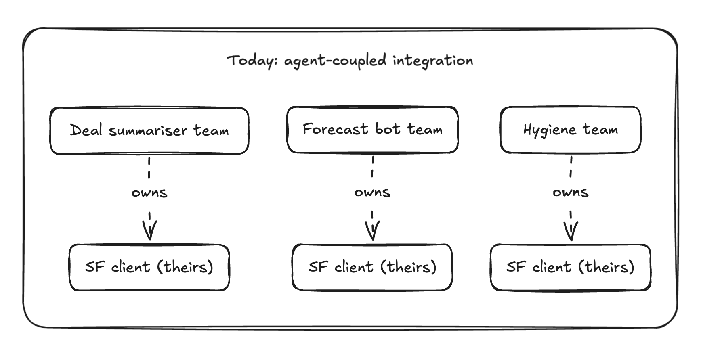
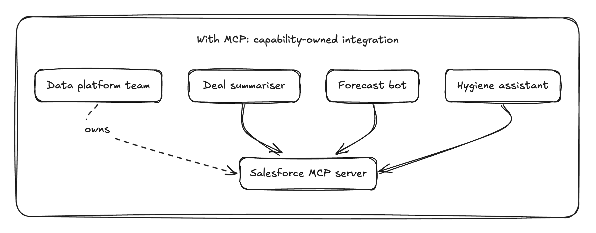
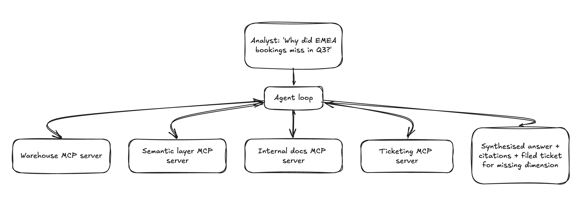

# 1 — What MCP is, and what it changes

> An honest framing of the problem MCP solves, the capabilities it opens up for an engineering organisation, and how it sits next to the alternatives.
>
> ~50 min. By the end you should be able to explain to a peer — without overclaiming — what MCP is, what it isn't, why it matters specifically for agentic work over your own data, and how it relates to A2A, function calling, and bespoke integration.

## The honest version of the problem

Strip away the marketing. The gap MCP fills is narrower than "AI integration is hard."

The actual gap is this: every LLM-driven runtime — Claude Desktop, an internal agent loop, Cursor, a customer-support copilot — needs to **discover what tools and data are available, read their schemas, invoke them with appropriate arguments, and consume the results in a structured way the model can act on**. There was no standard for that. So every team built it again. Different discovery formats. Different invocation conventions. Different ways of expressing "this is a resource you can read" versus "this is a tool you can call" versus "this is a prompt template you can fill."

This is a small, well-scoped problem. The Model Context Protocol — [released by Anthropic in late 2024](https://www.anthropic.com/news/model-context-protocol), open-spec from day one — solves it. It does not solve API design, upstream auth, schema drift in your warehouse, or any of the other genuinely hard parts of integration. Those remain hard.

What MCP gives you is **one consistent shape for the LLM host ↔ capability boundary**, which is the boundary that previously had no shape at all.

If you understand MCP as "LSP, but for LLM hosts," you've got it. If you describe it as "USB for AI" — which you will see in vendor decks — you're overclaiming. USB defined power, signalling, and physical layer. MCP is a JSON-RPC protocol over stdio or HTTP for exchanging tools, resources, and prompts. The analogy with LSP is shape, not scope: a defined protocol that lets N hosts talk to M servers without N×M bespoke wiring.

That's the technical claim. The rest of this chapter is about what changes in your organisation when you take it seriously.

## Marlin: the org we'll keep coming back to

**Marlin** is a fictional mid-market RevOps SaaS. ~250 engineers, ~$80M ARR. They sell pipeline analytics and forecast tooling to B2B sales orgs. They integrate with Salesforce, HubSpot, Slack, Gong, and Snowflake. They have three AI features in flight — a deal summariser, a forecast Q&A bot, a pipeline-hygiene assistant — each currently being built by a different team, each writing its own Salesforce client, each handling auth and rate-limiting differently and with varying competence.

Marlin's situation is unglamorously typical. We'll use them across all five chapters as the unit of analysis.

## What MCP changes for your engineering organisation

Three things, all narrower and more practical than "platform transformation":

### 1. The ownership shape of integration work changes

Today, when Marlin's deal-summariser team needs Salesforce data, they write a Salesforce client inside the deal-summariser codebase. Marlin's forecast-bot team does the same, separately. The Salesforce integration is *bound to the agent that needed it*, owned by whichever feature team got there first, and re-implemented by every subsequent team that needs the same data.

After MCP, Marlin's data platform team can publish a Salesforce MCP server once. Every internal agent — current and future — consumes it. The integration becomes a **standalone capability** with its own owner, its own on-call, its own version lifecycle, its own SLOs.





This is mostly a re-org of who owns what. It is the right re-org, because integration logic ends up in the team that should have always owned it, with the disciplines (rate-limit handling, retry policy, audit logging, credential rotation) that integration teams are already good at and that feature teams systematically aren't.

### 2. The line between "internal platform" and "developer experience" softens

Once Marlin has an internal MCP server for the warehouse, the incident management system, the feature flag service — every engineer's local Claude Desktop and Cursor can connect to them. The "internal AI assistant" stops being a project. It becomes an emergent property of your servers existing and your engineers pointing their hosts at them.

The practical consequence: a capability you ship for internal agents is **automatically available to humans-with-agents**. The same Salesforce MCP server that powers the deal summariser also lets an account exec ask Claude Desktop "show me every deal that's slipped twice this quarter and the reps who own them." No new code. No new product. Same server.

This collapses the distinction between "tools we build for our agents" and "tools we build for our people." That distinction was always somewhat artificial; MCP makes the artificiality structural rather than philosophical.

### 3. Your customers can bring their own agents to your product

This is the most consequential change and the most uncomfortable to think about clearly.

If Marlin publishes MCP servers that customers can authenticate against, Marlin's product gains a new consumption mode: **customers' own agents calling Marlin's capabilities directly**, without Marlin building a chat UI for them. A customer's revenue-ops analyst, sitting in their own Claude Desktop or internal agent platform, can ask questions of Marlin's data and get structured answers back, with Marlin's permission model still enforcing what they can see.

This is the first material change in the SaaS consumption model since the API economy of the early 2010s. It deserves the seriousness that change implied, including the strategic discomfort: if your product becomes a tool that someone else's agent calls, the relationship with the end user is mediated by an agent you do not control. That is worth a real conversation with your product organisation. It is not something to celebrate uncritically, and it is not something to ignore.

## What this opens up: agentic work over your own data

If there is one near-term capability MCP unlocks that justifies the whole investment, it is **agentic data exploration** — the work analysts, operators, and engineers do when they're forming hypotheses, asking follow-up questions, joining disparate sources, and refining as they go.

The pre-MCP version of this work: an analyst writes SQL, exports CSVs, joins them in a notebook, asks the data team for a column they don't have, waits two days, repeats. Or they use a BI tool, which constrains them to its semantic model and assumes they already know the question.

The MCP-enabled version: the analyst asks an agent. The agent has MCP servers for the warehouse, the semantic layer, the ticketing system, the internal documentation, and the dashboarding tool. It can roam.



In a single session that loop can:

- query the warehouse for the bookings shortfall,
- look up a metric definition in the semantic layer because it didn't recognise a column,
- read the ADR explaining why two tables look like duplicates but aren't,
- find the deal-review Slack channel where reps discussed the slipping deals,
- file a ticket for a missing pipeline-stage dimension when it hits a real data gap,
- and present the analyst with a synthesised answer they can verify.

That loop — query, refine, look up context, refine again — is what *exploration* actually is, and it is the part that BI tools structurally could not do because they assumed the question was already known. Agents with composable tool access can do it because the loop matches how an agent already works internally.

> **Hero illustration available.** A higher-fidelity rendering of this exploration loop — with numbered iteration markers, annotated steps across the four MCP servers, and the synthesised output including a filed ticket — can be produced from the prompt at [`visual-prompts/01-agentic-exploration-loop.md`](visual-prompts/01-agentic-exploration-loop.md). Two further chapter-1 prompts cover the integration-tax collapse ([`01-integration-tax-before-after.md`](visual-prompts/01-integration-tax-before-after.md)) and the customer-brings-own-agent network effect ([`01-protocol-network-effect.md`](visual-prompts/01-protocol-network-effect.md)).

This is not a thought experiment. It is the single highest-ROI use case most SaaS engineering organisations will see in the next twelve months, because the underlying capabilities (warehouse, semantic layer, docs, ticketing) already exist in most companies. Only the wiring is missing — and the wiring is what MCP standardises.

For Marlin specifically: their forecast-quality problem isn't that the forecast model is wrong. It is that pipeline data is messy in ways nobody has time to investigate end-to-end. An agent that can roam Salesforce, Gong call transcripts, deal-review Slack channels, and historical forecast accuracy metrics — refining its hypothesis as it goes — is the first credible answer to "why do our forecasts miss?" that doesn't require an analyst-week per investigation.

## A small concrete example, if you want one

You don't need to read this to follow the chapter. It's here so the shape of an MCP tool is concrete rather than abstract.

> **Optional — copy-paste to run.** What this proves: the unit of work in MCP is small. A tool is a name, a description, a schema, and a handler. The description is *not documentation* — it is read by the model when deciding whether to call the tool, which makes tool naming and tool descriptions a load-bearing part of the API. We come back to why in chapter 2.
>
> ```ts
> {
>   name: "search_deals",
>   description: "Use this when the user asks about deals, opportunities, or pipeline. Returns up to 25 matching Salesforce opportunities by name, account, or stage.",
>   inputSchema: {
>     type: "object",
>     properties: {
>       query: { type: "string" },
>       limit: { type: "number", default: 10 }
>     },
>     required: ["query"]
>   }
> }
> ```

## What MCP doesn't change

A short list, because honest framing requires it:

- **It does not make your APIs better.** A badly designed API wrapped in an MCP server is still a badly designed API. The model will struggle with it in much the same way humans do.
- **It does not solve auth.** You still need per-tenant credentials, token rotation, audit trails, scope enforcement. MCP gives you transport and discovery; you bring the security model. Chapter 4 is dedicated to this and is not optional.
- **It does not make agents reliable.** An MCP server with great tools, called by an agent with a poor system prompt and no evals, will still produce embarrassing outputs in front of customers. Chapter 5 covers what reliability work looks like.
- **It does not replace your data platform team.** It changes their *interface to the rest of the company*; it does not change their job.

## Alternatives, and how to think about them

MCP is not the only protocol in this space. Engineering leaders should be able to explain how it sits next to the others without falling into either "MCP wins" tribalism or "wait for a better one" paralysis.

**[A2A (Agent-to-Agent), Google](https://github.com/google-a2a/A2A).**
A2A defines how *agents talk to other agents* — task delegation, capability advertisement, coordination across multi-agent systems. MCP defines how *one agent talks to tools and resources*. They sit at different layers and are **complementary, not competitive**. A realistic near-future architecture has agents using A2A to delegate work to specialised agents that themselves use MCP to call tools. If your organisation is choosing one to invest in this year, MCP is the right one — agent-to-tool integration is the bottleneck most organisations hit first; multi-agent coordination is the bottleneck they hit second, after the first is solved.

**OpenAI function calling, Anthropic tool use, and other per-vendor formats.**
These are schemas for describing tools to one model family. They work, and they continue to work. The cost is portability: a tool defined for one vendor's format is not consumable by another vendor's host without re-wrapping. MCP defines a host-neutral format — implement an MCP server once and it works across compliant hosts. The inverse requires N adapters per tool. If you have one model and one host, vendor-native formats are fine. If you might ever have two, MCP starts paying for itself quickly.

**LangChain tools and other in-framework abstractions.**
In-process, framework-coupled. Useful for prototyping; they don't survive the lifetime of a framework version and they don't cross process boundaries. If your tool is a function in your agent's codebase, it's a framework tool. If your tool is a server that any compliant host can connect to, it's an MCP tool. The latter is what platform-grade integration looks like; the former is what a proof-of-concept looks like.

**OpenAPI / REST APIs.**
The thing MCP servers usually wrap. OpenAPI describes APIs; MCP describes how an LLM host should consume them. Not in conflict — a common pattern is to generate an MCP server from an OpenAPI spec. The protocol layer is agent-aware in ways the API layer isn't, and shouldn't need to be.

**No protocol — bespoke integration per agent.**
Still defensible if you're integrating one agent with one upstream and you will never need a second of either. Most organisations don't get to stay in that posture for long, and the bespoke code you write today gets thrown away when the second agent arrives. With MCP, the *clients* may evolve while your *servers* persist.

## Skills and MCP — adjacent, not alternative

The question that comes up most often once a leader has the MCP model in their head: *how does this relate to Claude Skills?* They look superficially similar — both extend what an agent can do — and the marketing around both is enthusiastic enough to blur the line. The line is worth drawing clearly, because they solve different problems and the right architecture usually uses both.

**A Skill is a folder.** At its simplest, a Skill is a directory with a `SKILL.md` describing when to use it, optionally accompanied by reference docs, scripts, and assets. The host (Claude Code, Claude Desktop, the Anthropic API with the skills feature enabled) loads the `SKILL.md` descriptions into context, decides when one is relevant, and then pulls in the rest of the folder on demand. Skills run *inside* the host's execution environment — when a Skill's instructions say "run this Python script," the host runs it locally with whatever filesystem and tools it already has.

**An MCP server is a process.** It runs separately, exposes a typed tool surface over a protocol, and is consumed identically by every compliant host. It owns its own credentials, its own rate limiting, its own audit log. The host calls it; it doesn't run inside the host.

That distinction — *bundled instructions and assets* versus *a separately-running typed capability* — is the whole thing. Most of the apparent overlap dissolves once you hold it.

### What they have in common

- Both are mechanisms for *progressive disclosure*: the model sees a short description first and only pulls in the full detail when it decides the capability is relevant. This matters because context windows have a budget.
- Both are *host-agnostic in principle*: a well-written Skill or MCP server is consumable by any host that supports the respective mechanism, not bound to a specific agent codebase.
- Both live or die by the **same load-bearing design choice as tools**: the description the model reads when deciding whether to engage. A Skill with a vague `SKILL.md` description will be ignored exactly as a tool with a vague description will be skipped. Chapter 2's "tool descriptions are prompts" claim applies to Skills word-for-word.
- Both are **composable**: a host can have many Skills and many MCP server connections simultaneously, and the model picks across all of them.

### Where they differ, and why it matters

- **Execution location.** Skills execute in the host's environment; MCP servers execute in their own. If the capability needs credentials the host shouldn't have, network access the host shouldn't have, or isolation from the host's filesystem, it belongs in an MCP server. If the capability is "given the files the user has in front of them, do this transformation," it belongs in a Skill.
- **State and ownership.** MCP servers are *operated*. They have an on-call, a deploy pipeline, a version, an SLO. Skills are *authored* — closer to a well-organised runbook than a service. A Skill doesn't have an SLO; the host that runs it does.
- **Multi-tenancy.** A remote MCP server can serve thousands of customers, each with their own auth scope. Skills don't multi-tenant; they're loaded per-host-session. If your capability needs to enforce per-tenant data boundaries, it must be an MCP server. A Skill cannot meaningfully do this on its own.
- **Determinism of capability.** A Skill can include scripts that the model invokes verbatim — useful when you want the same operation done the same way every time. MCP tools are typed function calls with structured arguments; the model fills the arguments but the operation is fixed by the server. Both are more deterministic than free prose, in different ways.
- **Update cadence.** Updating a Skill is a `git pull` against a folder. Updating an MCP server is a deploy. The latter is heavier; the former is appropriate for capabilities that genuinely change quickly and don't need an operations story.

### When to reach for which

A useful first cut, in Marlin's vocabulary:

- **MCP server** when the capability is *talking to a system Marlin operates or integrates with* — Salesforce, the warehouse, the ticketing system, Marlin's own product. Anything that needs credentials, multi-tenancy, audit logging, or rate limiting. Anything that customers' agents might eventually consume. Anything where "who's allowed to do this?" has a non-trivial answer.
- **Skill** when the capability is *a way of working* the model should adopt — a house style for writing forecast memos, a structured approach to reviewing pipeline-hygiene reports, a packaged set of reference materials and helper scripts for triaging deal-stage anomalies. Anything that's mostly *instructions and reference content* with optional helper code, where the host's own environment is sufficient to execute.
- **Both** when the way of working *uses* the systems. A "weekly forecast review" Skill that walks the model through Marlin's review methodology will, in the course of doing that, call MCP tools against the warehouse and Salesforce. The Skill encodes the process; the MCP servers expose the capabilities the process needs.

The shorthand: **MCP is for capabilities, Skills are for know-how.** Capabilities need operating; know-how needs authoring. They compose cleanly because they're answering different questions.

### Where they work well together

The architecture pattern that's emerging for organisations that take both seriously: a **small number of well-operated MCP servers** owned by the platform team, plus a **growing library of Skills** authored by the teams closest to the work, each Skill pulling on whichever MCP servers it needs.

Marlin's shape, made concrete:

- The platform team operates four MCP servers — Salesforce, warehouse, ticketing, internal docs. Each has an owner, an on-call, a versioning story.
- The RevOps team authors a `forecast-review` Skill that encodes how Marlin runs forecast calls — what to look at, in what order, what counts as a red flag. The Skill calls the warehouse and Salesforce MCP servers as it works.
- The customer-success team authors a `churn-investigation` Skill that uses the same MCP servers but encodes a different methodology and a different set of red flags.

Two Skills, four servers, no duplication. The platform team isn't on the hook for understanding forecast methodology, and the RevOps team isn't on the hook for credential rotation against Salesforce. Each side owns the part it's best placed to own.

This is the same ownership-shape argument from earlier in the chapter, applied one level up: Skills are to MCP servers what feature teams are to platform teams. The protocol just made it possible for the seam between them to be clean.

## What to take from this chapter

The honest framing, in five lines:

- MCP is a narrow, well-scoped protocol that fills a real gap: the LLM host ↔ capability boundary.
- It changes the *ownership shape* of integration work inside your organisation, makes internal capabilities reusable across both human and agent consumers, and opens a new external consumption mode in which customers' own agents call your product directly.
- Its highest-leverage near-term use case is agentic work over your own data — exploration loops that BI tools structurally could not do.
- It is **complementary** to A2A, not a substitute. It supersedes per-vendor function-calling formats only if cross-host portability matters to you, which it usually does.
- It is also **complementary to Skills**: MCP is for capabilities (operated by a platform team), Skills are for know-how (authored by the teams closest to the work). The mature architecture uses both.
- It does not solve auth, API design, agent reliability, or any of the genuinely hard problems. Those problems are the rest of this track.

Chapter 2 takes the host/client/server model and gives it teeth — what each piece actually is, how a request flows end to end, and the single design decision (tool naming) that disproportionately determines whether your agents work in production.

---

→ Next: [The mental model](02-mental-model.md)
