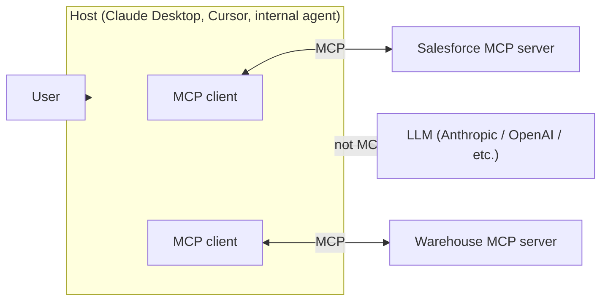
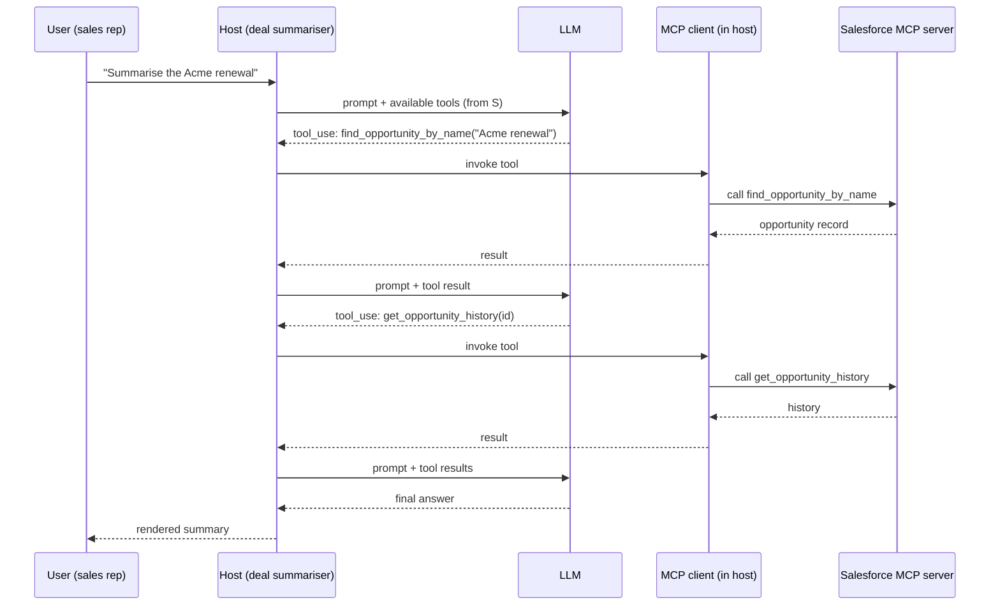

# 2 — The mental model

> The four parts that make up an MCP system, the three things a server can offer, and the one design choice that disproportionately determines whether your agents work in production.
>
> ~50 min. By the end you should be able to read an MCP architecture diagram, follow a request end-to-end, and recognise — without reading the code — when a server has been designed thoughtfully or sloppily.

## The four parts

A working MCP system has four parts. Many people conflate them, and the conflation makes architecture conversations vague.

- **Host** — the application the user is actually using. Claude Desktop. Cursor. Marlin's internal agent runtime. The host owns the LLM connection, the user session, and the orchestration loop. *This is where "the agent" lives.*
- **Client** — a small component inside the host that speaks MCP. One client per server connection. Mostly invisible; you usually don't think about it. It exists so the host can manage many server connections cleanly.
- **Server** — the thing exposing tools, resources, and prompts. A separate process. Owned by your platform team or by a third party. *This is what your team builds and operates.*
- **LLM** — the model the host calls. **Not part of MCP.** MCP is host-to-server; the model sits behind the host and is independent of the protocol. Swapping models doesn't change your servers.



A common confusion worth flagging: people say "the MCP" as if it's a thing. It isn't. MCP is the protocol. *Servers* and *hosts* are things; MCP is what they speak. When someone says "we're building an MCP," they almost always mean "we're building an MCP server" — and the distinction matters because the server is the artefact your team owns.

The other distinction worth holding: **the model is not part of MCP**. This is what makes the protocol durable. If Anthropic ships a new model, your servers don't change. If you switch from Claude to a different model family, your servers don't change. The investment your platform team makes in MCP servers is independent of the model market, which is the part of the AI stack that moves fastest.

## The three primitives

A server can offer three kinds of thing. Knowing what each is for matters mainly for designers; for a leader, knowing the three exist and what they're for is enough to follow design conversations.

**Tools** — functions the model can call. Side effects allowed. The most-used primitive by a wide margin. `find_opportunity_by_name`, `log_call_summary`, `create_ticket`. If the model needs to *do* something, it's a tool.

**Resources** — read-only contextual data the host can pull and put in the model's context. A file the model should be aware of, a piece of structured data, a fragment of documentation. Resources are *pulled by the host*, not invoked by the model. Think of them as "context the model didn't know it needed yet."

**Prompts** — pre-written prompt templates a server can offer, surfaced to the user via slash commands or quick-actions in the host. Less commonly used. Useful when the server has opinions about *how* a user should interact with its tools (e.g. "/summarise-deal" might be a prompt the Salesforce server provides).

The honest take: most servers in practice ship many tools, some resources, and few prompts. That's fine. The interesting design work is almost always on the tool surface.

## What happens when a user asks a question

End-to-end, with Marlin's deal summariser as the example:



A few things to notice:

- **The host orchestrates the loop.** The LLM doesn't talk to the server. It tells the host *which tool it wants to call*, the host calls the server, and feeds the result back to the model. The host is in charge.
- **The model decides which tools to call** based on the tool list the host gave it. The tool list is just names + descriptions + schemas (more on this in a moment).
- **The loop is bounded.** Hosts cap iterations. If the model keeps wanting to call tools forever, the host stops it. This matters for cost and for your reliability story (chapter 5).
- **Each tool call is independent.** The server doesn't generally know one call is related to another in the same conversation. Servers that need session state need to be designed deliberately for it (chapter 3).

This loop is the thing your engineers will spend the most time staring at when something goes wrong. Understanding its shape is the most valuable single piece of MCP literacy a leader can have.

## Transports: stdio vs HTTP

Two transports matter in practice.

**stdio** — the server is a local subprocess of the host. The host launches it, talks over stdin/stdout, and shuts it down on exit. This is how Claude Desktop and Cursor talk to local servers. Trusted execution environment (the user's own machine), no network exposure, no auth needed beyond what the OS provides.

**HTTP (with Server-Sent Events for streaming)** — the server is a remote service. Multi-tenant. Internet-exposed. Needs auth, TLS, rate limiting, audit logging, the usual. This is how Marlin would expose its Salesforce MCP server to its own customers.

The choice is mostly determined by who's running the host:

- Server runs on **the same machine as the user**? stdio.
- Server runs on **your infrastructure, consumed by remote clients**? HTTP.

Both transports speak the same protocol. A server can ship both, and most production servers eventually do. Architecturally the difference is small; operationally (auth, rate limiting, multi-tenancy, observability) it's significant.

## Tool descriptions are prompts

This is the single load-bearing claim of the chapter, and the one that disproportionately determines whether your agents work in production.

When a host hands a tool list to the model, the model decides which tool to call by **reading the tool's name and description**. There is no other signal. The schema constrains arguments; the description decides selection.

Which means: **tool names and descriptions are not documentation. They are prompts read by the model.** A leader who reviews tool design as if it were API documentation will systematically miss the things that matter.

A concrete contrast. Here's a Salesforce MCP server's tool surface, designed badly:

```ts
{ name: "query", description: "Queries the Salesforce database." }
{ name: "get",   description: "Gets a record." }
{ name: "search", description: "Searches Salesforce." }
{ name: "update", description: "Updates a record." }
```

This will produce visibly worse agent behaviour. Faced with "summarise the Acme renewal," the model has to guess between `query`, `get`, and `search`. It will guess wrong some of the time. When it guesses right, it spends extra tokens reasoning about why.

The same surface, designed well:

```ts
{
  name: "find_opportunity_by_name",
  description: "Use this when the user asks about a specific deal or opportunity by name. Returns the opportunity record including stage, amount, close date, and owner."
}
{
  name: "list_opportunities_for_account",
  description: "Use this when the user wants to see all open deals for an account or customer. Returns up to 25 opportunities sorted by close date."
}
{
  name: "get_opportunity_history",
  description: "Use this after find_opportunity_by_name when the user asks about how a deal has changed over time — stage transitions, amount changes, slipped close dates."
}
{
  name: "log_call_summary",
  description: "Use this when the user asks you to record a summary of a sales call against a deal. Takes the opportunity ID and the summary text."
}
```

Differences worth naming explicitly:

- **Verbs match how a user would phrase a request.** A user says "find the Acme deal," not "query Salesforce for opportunity Acme."
- **The description starts with "Use this when…"** — it tells the model when to pick this tool, not what the tool does internally. The model needs the former; the latter is for human readers (and is fine to add as a second sentence).
- **Tools are bounded.** No "query the database" passthrough. The agent can't construct queries the server doesn't anticipate, which sounds like a limitation but is actually a feature: the surface is *self-disambiguating*. Faced with any reasonable request, the model can pick the right tool from name and description alone.

> **Optional — copy-paste to run.** What this proves: tool selection is decided entirely by name and description. If you give the same model two tool sets — vague names vs verbs-with-use-this-when — and ask it the same question, the second set produces measurably better selection. This is what eval mode in chapter 5 measures. (The `instrument(...)` wrapper in the handler is a logging/audit hook introduced properly in chapter 3.)
>
> ```ts
> // server/src/tools/find-opportunity.ts
> export const findOpportunityByName = {
>   name: "find_opportunity_by_name",
>   description: "Use this when the user asks about a specific deal or opportunity by name. Returns the opportunity record including stage, amount, close date, and owner.",
>   inputSchema: {
>     type: "object",
>     properties: {
>       name: { type: "string", description: "The opportunity name or close match" }
>     },
>     required: ["name"]
>   },
>   handler: instrument("find_opportunity_by_name", async ({ name }) => {
>     const z = require("zod");
>     const args = z.object({ name: z.string() }).parse({ name });
>     return await salesforce.searchOpportunities(args.name, { limit: 1 });
>   })
> };
> ```

The wrong instinct, when designing a server, is "let's just expose the API." The right instinct is "what are the verbs the agent will need, and how do we make those self-disambiguating?" The first instinct produces 200-tool servers that confuse the model and bloat the context window. The second produces 8-tool servers that just work.

## What this means for Marlin's CRM-style server

Marlin's Salesforce MCP server is the most consequential server they'll ship. Two design directions:

**Tempting and wrong:** expose `salesforce_query(soql)` — a single tool that takes raw SOQL. "Powerful." "Complete." "Lets the agent do anything."

In practice this fails. The model has to know SOQL well, has to construct queries that match Marlin's specific Salesforce schema, and has to handle the full surface area of Salesforce's quirks. Tool calls fail more often. When they succeed, the agent has spent significant tokens working out the query rather than answering the user's question. The "complete" surface is also impossible to safely audit, rate-limit, or permission — you have to inspect the SOQL itself to know what the agent is doing.

**Less tempting and right:** ship a bounded set of named verbs — `find_opportunity_by_name`, `list_opportunities_for_account`, `get_opportunity_history`, `search_recent_emails_for_account`, `log_call_summary`, `create_followup_task`. Maybe 12 tools total, each one a thing a sales user would actually ask for in those words.

This is more design work upfront. It requires the platform team to *know what their agents need to do*, which forces useful conversations with the feature teams. The tool set will need to grow as use cases expand. That's fine. Bounded growth driven by real demand is a feature; unbounded passthrough surfaces are a smell.

## What to ask in a design review

A short list of questions a senior leader can ask when their team puts an MCP server design in front of them. None require reading the code.

- **Do tool descriptions start with "Use this when…"?** If they describe what the tool does internally, they're documentation, not prompts.
- **Are the tool names verbs that match how a user would phrase a request?** `find_account_by_domain` good; `account_lookup` mediocre; `query` bad.
- **Is the tool count bounded?** Servers with 50+ tools start to compete for the model's attention. If the count is climbing, ask whether some tools should be consolidated or whether you actually need a second server.
- **Is there a story for tool versioning?** Tool surfaces change. If an agent in production has been calling `find_opportunity_by_name` for six months and the team renames the tool, every host pinned to the old name breaks. Versioning is solvable; it has to be planned.
- **Are tools idempotent where possible?** Agents retry. Non-idempotent tools (`charge_card`, `send_email`) need explicit guards.
- **Is the server stateless across requests, or does it carry session state?** Stateless is simpler and scales easily. Session-stateful servers are sometimes necessary but raise the operational bar — they're chapter 3 material.

These questions surface design intent, not implementation detail. A team that can answer them clearly is doing the work; a team that can't is shipping the design they happened to land on.

## What to take from this chapter

- The four parts: **host, client, server, LLM**. The model is not part of MCP, which is what makes the protocol durable.
- The three primitives: **tools, resources, prompts**. Tools dominate in practice.
- A request lifecycle is a **bounded loop** orchestrated by the host. The model decides *which tools to call*; the host actually calls them.
- Two transports: **stdio for local, HTTP for remote**. Same protocol, different operational profile.
- **Tool names and descriptions are prompts**, not documentation. They are the most load-bearing design surface in the entire system. A leader who treats this as cosmetic will get worse agent behaviour and not know why.

Chapter 3 takes this mental model and goes one level deeper into architecture: how multiple servers compose, when to split a server vs add tools to an existing one, how to handle multi-tenancy and state, and what production-grade tool design looks like beyond the basics covered here.

---

→ Next: [Architecture in depth](03-architecture-in-depth.md)
