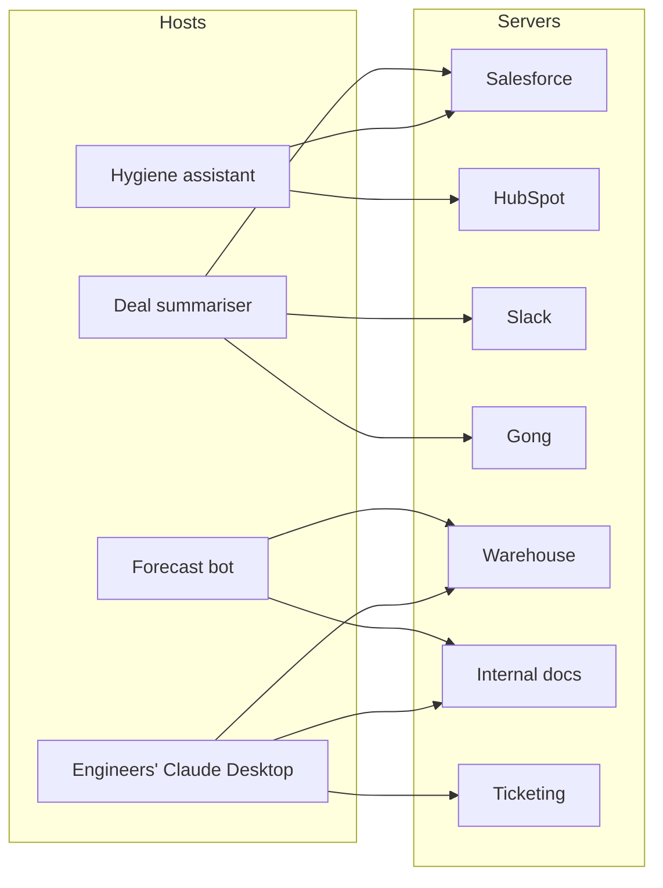

# 3 — Architecture in depth

> The production-shape decisions: where servers run, how identity flows, where state lives, how granular tools should be, how surfaces evolve, and how multiple servers compose.
>
> ~55 min. By the end you should be able to read an MCP architecture proposal critically — spot multi-tenancy holes, ask the right questions about state and versioning, and tell the difference between "demo architecture" and "production architecture."

## Where servers run, taken seriously

Chapter 2 introduced stdio and HTTP as the two transports. In production this looks like a binary protocol choice; it isn't. The transport you pick determines the entire operational profile — auth, observability, deployment, on-call, audit, the whole envelope.

**Local stdio servers** are launched as subprocesses by the host on the user's machine. The user is the trust boundary. There's no auth (the OS provides it). There's no rate limit (the user can't DDOS themselves). There's no audit log to ship anywhere (the user owns the machine). They are cheap to ship and right by default for any server whose data is private to the user — local file access, local databases, the user's own API keys.

**Hosted HTTP servers** are services. Owned by an operator. Multi-tenant by default. Internet-exposed. They need TLS, auth, rate limiting, audit logging, on-call, deployment pipelines — the full production checklist. Right for any server whose data is *not* the user's alone: Marlin's Salesforce server (Marlin's data, accessed by Marlin's users), a customer's CRM exposed to that customer's own agents, a B2B data product.

The architectural decision underneath is **who owns the data the server reads and writes**. If the answer is "the user," ship stdio. If the answer is anyone else — your organisation, your customer's organisation, a third party — ship HTTP.

The mistake to avoid: shipping a hosted HTTP server with stdio's operational discipline. Most public security incidents involving MCP servers in the past year have involved exactly this pattern — a server treated like a local toy that turned out to be exposed to the internet.

## Multi-tenancy: the identity question that changes everything

A hosted MCP server worth running serves more than one user. The moment it does, identity becomes the hardest part of the architecture.

Three different identities flow through the system, and conflating them is how multi-tenant SaaS leaks data:

- **Host identity** — *which application* is calling. Cursor, Claude Desktop, Marlin's internal agent runtime.
- **User identity** — *who* the action is for. The end user the host is acting on behalf of.
- **Downstream credentials** — *what the server uses to do its job*. The API tokens, OAuth grants, or service accounts the server holds to talk to Salesforce, the warehouse, etc.

Concretely, when one of Marlin's customers — call them Acme — uses their own Claude Desktop to query Marlin's Salesforce MCP server:

```mermaid
sequenceDiagram
  participant U as Acme rep
  participant CD as Claude Desktop (Acme's)
  participant M as Marlin Salesforce MCP server
  participant SF as Acme's Salesforce instance

  U->>CD: "Show me my open deals"
  CD->>M: tool call + Acme rep's bearer token
  M->>M: validate token; identify tenant (Acme) + user (rep)
  M->>SF: query, scoped to Acme + rep's permissions
  SF-->>M: deals (only ones rep can see)
  M-->>CD: filtered result
```

A few things have to be true for this not to be a leak:

- The token Claude Desktop sends has to identify **the Acme rep** specifically, not "an authenticated Marlin user." That requires Marlin's auth to support OAuth (or equivalent) so a customer's user can authenticate to Marlin's MCP server with their own identity.
- Marlin's server has to know **which tenant** the rep belongs to and scope every downstream call accordingly. Cross-tenant data leakage in an MCP server is the same severity of incident as anywhere else; the agent loop makes it harder to spot because the breach surfaces as "the AI gave Acme answers about Beta's data" rather than as a clean error.
- Downstream Salesforce credentials should respect **the rep's own permissions**, not the broad service credentials Marlin might hold for admin work. Usually this means per-user OAuth tokens, not a shared service account.

This is unfamiliar territory for many SaaS teams whose APIs have historically been called by the customer's *backend* (one trusted caller per tenant) rather than the customer's *agents* (many callers per tenant, each acting as a different user). It's worth flagging early to your security and identity teams — it isn't a bolt-on.

## State, and why you probably don't want it

A **stateless** MCP server treats every tool call as independent. No memory of prior calls, no session. The server scales horizontally, any instance can handle any request, restarting is free.

A **stateful** server keeps something across calls — an open database transaction, an authenticated session, a pagination cursor, a long-running job handle. Statefulness buys ergonomic things (tools that build on each other within a conversation) at significant operational cost (sticky sessions, session expiry, recovery from instance failure, observability into "which session is this").

Honest default: **ship stateless**. Resist statefulness until a use case forces it. When it does:

- Be explicit about session lifetime — minutes? hours? a single conversation?
- Persist session state in a shared store (Redis, Postgres) so any instance can serve any session.
- Decide what happens when a session is lost mid-conversation. The usual answer is the host re-establishes and the agent retries; that path needs to be tested, not assumed.

Stateful servers aren't wrong, but they multiply the operational surface. A leader reviewing a server design should ask "is this stateless?" and treat "no" as a question that needs a real answer.

## Tool granularity: verbs vs workflows

Chapter 2 made the case for verbs. Production systems force a deeper question: **how granular should the verbs be?**

Two ends of the spectrum:

**Fine-grained, one-thing-per-tool.** `find_opportunity_by_name`, then `get_opportunity_owner`, then `get_owner_email`, then `compose_email`. The agent composes these into workflows on the fly. Easy to maintain, easy to evaluate, easy to permission. Cost: more tool calls per user request, more tokens, more latency.

**Coarse-grained, workflow-per-tool.** `summarise_opportunity_for_review` — one call, server joins everything, returns a synthesised result. Fewer round trips. Faster. Cost: the workflow is baked in; the agent can't deviate; adding a new workflow is a server change rather than a prompt change.

Neither extreme is right on its own. Healthy production servers ship both:

- **Primitive verbs** for the long tail of agent reasoning.
- **A handful of workflow tools** for the high-frequency, stable patterns where round-tripping wastes tokens.

The question to ask of any candidate workflow tool: *is this workflow stable enough to commit to the tool surface, or fluid enough that we want the agent to assemble it from primitives?* Stable + high-frequency → workflow tool. Fluid or rare → leave it to primitives.

## Versioning: the discipline most teams underinvest in

Tool surfaces change. Renames, signature changes, deprecations. Every change is a potential break for every host depending on the surface — including hosts you don't operate, like a customer's own Claude Desktop instance pinned to last quarter's tool names.

The minimum discipline:

- **Tools are additive by default.** Add new tools rather than mutating existing ones. Old tools live on until you have evidence nothing's calling them.
- **Renames are deprecations, not edits.** Ship the new name alongside the old. Mark the old description as deprecated. Remove only after a quiet period.
- **Description changes are not free.** Changing a tool's description changes how the model selects it. A description tweak can move selection rates by tens of percent in evals (chapter 5). Treat description changes the way you treat prompt changes — versioned, evaluated, rolled out deliberately.
- **Treat your tool surface like an API surface.** If you'd version a REST API, version your tool surface with the same discipline.

Most teams underinvest here because the agent loop hides breakage. A renamed tool doesn't 404 loudly; it causes the model to guess wrong and produce a worse answer. The breakage is silent and shows up in user-experience metrics, not error rates. Plan for it.

## Server composition: many small, one host

The realistic architecture for an organisation a year into MCP investment is **many small purpose-built servers, owned by the right teams, connected directly to hosts**.

Marlin's likely shape:



Each server owned by the team that should own that capability. Each independently versioned, deployed, monitored. Each host wires up to the servers it needs — no coupling between hosts, no coupling between servers.

Two patterns worth knowing about and using sparingly:

**Gateways / aggregators.** A single MCP server that talks to multiple downstream services and exposes a unified surface. Useful when downstream services are an implementation detail you don't want exposed, or when you want centralised auth/audit/rate-limiting at one chokepoint. Cost: it's a new system to operate, and it can become a bottleneck. Use when there's a clear reason; default to direct host-to-server connections.

**Server-of-servers / federation.** An MCP server whose tools delegate to other MCP servers. Mostly useful when you're building a *product* whose value is aggregating other people's MCP servers. Almost certainly not what your platform team should build first.

The architectural default — many small purpose-built servers — is the boring answer and usually the right one. Gateways and federation are optimisations to apply later, with cause, not patterns to design around upfront.

> **Optional — copy-paste to run.** What this proves: a single per-tool instrumentation wrapper is the right place to attach tenant identity and audit logging. One wrapper, every tool gets it for free, and chapter 4 will extend the same wrapper into the audit trail. This is what makes "many small servers" operationally cheap.
>
> ```ts
> // server/src/instrumentation.ts (sketch)
> export function instrument<T extends (args: any, ctx: Context) => Promise<any>>(
>   toolName: string,
>   fn: T
> ): T {
>   return (async (args, ctx) => {
>     const start = Date.now();
>     const argsHash = sha256(JSON.stringify(args));
>     log({ event: "tool_call", tool: toolName, tenant: ctx.tenantId, user: ctx.userId, argsHash });
>     try {
>       const result = await fn(args, ctx);
>       log({ event: "tool_call_ok", tool: toolName, durationMs: Date.now() - start });
>       return result;
>     } catch (err) {
>       log({ event: "tool_call_err", tool: toolName, error: String(err) });
>       throw err;
>     }
>   }) as T;
> }
> ```

## What to ask in an architecture review

Complementary to chapter 2's design-review questions, six to ask of any MCP architecture proposal:

- **Where does this server run, and who owns the data it reads?** Anyone other than the user → hosted, with the full operational checklist.
- **How does user identity flow through to downstream calls?** A hosted server without a crisp answer is a multi-tenancy incident waiting to happen.
- **Is this server stateless?** If not, why not, and where does state live?
- **What is the rough tool count, and how is it changing?** Steady growth is healthy; explosive growth or surfaces past ~30–40 tools deserve scrutiny.
- **What happens when we rename a tool?** "We just rename it" means the team hasn't thought about versioning.
- **Are we composing many small servers, or building one server that does everything?** Many small is the default; one big needs justification.

These plus chapter 2's tool-design questions are roughly the surface a tech-review board should be probing when an MCP server proposal comes up.

## What to take from this chapter

- **Where the server runs determines the operational profile.** Local stdio and hosted HTTP are not equivalent; treating one like the other is the most common architectural error in the field.
- **Multi-tenancy is an identity problem first.** Three identities — host, user, downstream credentials — must not be conflated. Customers bringing their own agents makes this harder, not easier.
- **Stateless is the default.** Stateful is an explicit decision with explicit operational consequences.
- **Tool granularity is not fine-vs-coarse — it's both.** Primitives for reasoning; workflow tools for stable, high-frequency patterns.
- **Versioning matters more than teams realise**, because breakage is silent and surfaces in UX metrics rather than error rates.
- **Many small servers, owned by the right teams, beats one big server.** Gateways and federation are later-stage optimisations.

Chapter 4 takes these architectural pieces and runs the security question across them: given this shape, what's the threat model? Prompt injection, exfiltration, audit, and a STRIDE pass tailored to MCP.

---

→ Next: [The risk surface](04-risk-surface.md)
