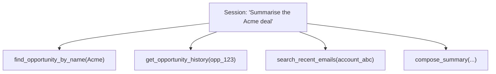

# 5 — Making it reliable

> Evals as regression tests, observability that fits agentic systems, cost as a multi-dimensional surface, and versioning a tool surface without breaking the agents that depend on it. What "production-grade MCP" actually looks like.
>
> ~55 min. By the end you should be able to tell the difference between a system that's been demoed and a system that's been operated, and to ask the questions that surface the gap.

## "It worked in demo" is not a green light

The gap between demo and production is bigger for agentic systems than for traditional software, and not for the reasons most engineering leaders expect.

It's not just non-determinism, though that's part of it. It's the combination of four things, each of which would be manageable on its own and which compound when stacked:

- **The model is non-deterministic.** Same prompt, different tool selection on different runs. Acceptable in demos, where you've cherry-picked the prompts that work; expensive in production, where you can't.
- **The input distribution is open-ended.** No API contract on what users will type. The eval set you ship with represents a tiny slice of what users will actually ask.
- **Failures are silent.** A wrong tool selection produces a wrong answer, not an error. Nothing in the system logs flags it. The signal lives in user feedback, customer complaints, and aggregate quality metrics — none of which you can build a pager rotation around.
- **Changes are non-local.** Renaming a tool, adding a new tool, or even just tweaking a tool description can shift the model's behaviour on *unrelated* tool calls, because the model is choosing from the whole surface.

This combination is what reliability work is for. The four pillars covered in this chapter — evals, observability, cost, versioning — are what closes the gap. Most teams ship without two or three of them and find out the hard way which ones were load-bearing.

## Evals as regression tests

The core practice, and the single most undervalued discipline in this space.

An eval suite is a JSONL file of cases. Each case has a user prompt, an expected tool selection (or sequence of selections), and optionally an expected outcome. The eval runner runs the agent against each case and reports pass/fail. You run it on every change to tools, descriptions, or system prompts. Failures are red.

For Marlin's deal summariser, an early eval suite might be 30 cases:

```jsonl
{"prompt": "Summarise the Acme deal", "expect_tools": ["find_opportunity_by_name", "get_opportunity_history"]}
{"prompt": "What deals does Jamie own?", "expect_tools": ["list_opportunities_for_owner"]}
{"prompt": "Show me deals closing this month", "expect_tools": ["list_opportunities_by_close_date"]}
{"prompt": "Which deals slipped from Q2?", "expect_tools": ["list_opportunities_by_close_date", "get_opportunity_history"]}
```

What this catches:

- **Tool selection regressions when descriptions change.** A description tweak that improves selection for "find" queries can degrade selection for "search" queries. The eval suite makes this visible.
- **Regressions when the tool surface grows.** A new tool overlapping with an existing one starts capturing requests it shouldn't. Without an eval suite, this looks like "the agent has been off lately."
- **Regressions when the model is upgraded.** A new model version may select tools differently — sometimes better, sometimes worse on your specific surface. Evals are how you find out before customers do.
- **Bugs in tool handlers**, when the eval also asserts on output structure or shape (not just which tool was selected).

What evals don't catch:

- **End-to-end answer quality.** The agent might pick the right tools and still produce a bad answer. End-to-end quality needs human review, eventually rubric-based or model-judged.
- **Adversarial inputs.** Most evals are happy-path. Prompt injection cases are a separate suite (and chapter 4's mitigations are how you defend, not how you eval).
- **Performance regressions.** Evals measure correctness. Latency and cost need their own monitoring.

> **Optional — copy-paste to run.** What this proves: an eval is a small, ordinary file. The discipline is in running it on every change, not in the technology.
>
> ```ts
> // harness/src/eval.ts (sketch — see W3 of the practitioner pathway)
> import { readFileSync } from "node:fs";
>
> const cases = readFileSync("evals/cases.jsonl", "utf8")
>   .trim().split("\n").map(line => JSON.parse(line));
>
> let pass = 0, fail = 0;
> for (const c of cases) {
>   const trace = await runAgent(c.prompt);
>   const toolsCalled = trace.filter(t => t.type === "tool_use").map(t => t.name);
>   const ok = c.expect_tools.every(t => toolsCalled.includes(t));
>   ok ? pass++ : fail++;
>   console.log(`${ok ? "✓" : "✗"} ${c.prompt}`);
> }
> console.log(`\n${pass}/${pass + fail} passed`);
> ```

The cadence that matters: **on every change**, automated, with failures gating merges. Most teams ship without this for too long because "we've tested it" — they tested 20 prompts manually once. Evals turn 20 manual prompts into 200 automated ones, repeatable, owned. The investment is small; the leverage is large.

## Observability: traces, not just logs

Three levels of telemetry, each useful for a different question.

**Per-tool-call structured logs** — every tool call as a structured line (tool name, tenant, user, args hash, duration, outcome). Chapters 3 and 4 covered this. It's the foundation; everything else is built on it.

**Per-session traces** — a session is a tree. A user prompt at the root, tool calls as children, sometimes nested when one tool call's result drives the next. This is the unit of debugging an agentic system.



When something goes wrong, you don't grep logs — you pull the session trace and look at it as a tree. OpenTelemetry is the natural fit; chapter 3's instrumentation wrapper extends to OTel spans without much ceremony, which is one of the reasons that wrapper is worth standardising on.

**Aggregate metrics** — tool call rate, tool error rate, p50/p95 latency, model iteration counts per session, tokens per session, cost per session. The dashboards you'll build first.

The bug shape unique to agents: **silent failure**. Tool call succeeds, returns subtly the wrong thing, agent uses it, produces a wrong answer. Nothing in the runtime logs is red. The signal lives in eval results (which is why evals are the *first* pillar) and in user feedback. Build a feedback channel — thumbs-up/down on agent answers, surfaced to the same dashboard as the operational metrics. Treat downvotes as a leading indicator of regressions; they often precede them by days.

## Cost: a multi-dimensional surface

Agent cost is not just "model tokens." A single user request consumes:

- **LLM tokens** — every agent loop iteration is a model call; large tool results consume input tokens; longer reasoning consumes output tokens.
- **Tool call costs** — some MCP servers wrap APIs that cost per call (Salesforce API allowances, paid third-party APIs, embedding lookups).
- **Downstream system load** — the warehouse query that takes a slot, the third-party search that counts against your monthly quota.

Two patterns to make non-negotiable from day one:

**Per-session budgets.** Hard caps on iterations and on cost. If a session has made N tool calls or spent more than $X, the host stops the loop. This is your DoS protection from chapter 4 doing its other job — runaway agent loops are mostly a cost problem before they're a security one.

**Per-tenant cost attribution.** Cost is generated by tenant and user. Without attribution you can't bill, can't shut off abusive tenants, can't tell which features are expensive, can't have an honest unit-economics conversation. The same identity work from chapter 3 is what makes cost attribution work — if you got identity flow right, you mostly get cost attribution for free.

The numbers compound faster than they look. Marlin's deal summariser might average $0.03 per summary. One rep asks 200 questions in a day = $6. Marlin has 10,000 reps across customers. Without per-tenant caps and attribution, Marlin discovers the shape of their cost surface through their bill rather than their dashboard, and the conversation that follows is uncomfortable in ways that could have been avoided with two days of upfront work.

## Versioning and rollout

How do you ship a change to a tool surface without breaking the agents that depend on it? The same way you ship API changes — with the agent-specific twist that breakage is silent.

Four patterns that work, in increasing order of investment:

**Eval-gated changes.** The minimum bar: run the eval suite on the change. If selection rates drop on any case, the change doesn't ship. Cheap; doesn't catch everything; non-negotiable.

**Shadow mode.** Run the new version of the tool surface in parallel with the old on a sample of real traffic. Compare selection rates and outputs. Promote when the new version performs at least as well as the old. More work; catches things eval suites miss because the eval suite is finite and traffic isn't.

**Canary by tenant.** Roll out a new tool surface to a small percentage of tenants. Watch eval results, error rates, user feedback. Expand gradually. The standard deployment-canary pattern, applied to tool surfaces.

**Feature flags on tools.** Some hosts let you flag tools on/off per session. Useful for rolling back individual tools without redeploying the server, and for gradual rollout of a new tool to a subset of users. Highest ergonomic investment; pays off when you're shipping changes weekly.

The deprecation discipline from chapter 3 lives here in execution: when renaming a tool, ship the new alongside the old, mark the old as deprecated, watch usage metrics, remove only when usage hits zero plus a buffer. Customer agents pinned to the old name break silently otherwise — the agent doesn't error, it just guesses worse.

## What "production-grade" looks like

A consolidated picture, beyond the architecture and security work of the previous chapters:

- **Eval suite** covering at least the top 20–30 user intents, run on every change, gating merges.
- **Per-tool-call structured logs** with tenant, user, args hash, outcome.
- **Per-session traces** queryable by session ID, with the trace tree as the unit of investigation.
- **Per-session iteration and cost caps**, enforced in the host.
- **Per-tenant cost attribution** in dashboards.
- **Tool surface versioning policy** with deprecation discipline that's been written down.
- **A rollout pattern** (eval-gated → shadow → canary → flags) for tool changes, used routinely.
- **An on-call playbook** covering the agent-specific failure modes: silent wrong-answer reports, tool-selection regressions, runaway loops, prompt-injection reports, cost spikes.

Most of this is operational discipline, not technology. The technology is mostly available off-the-shelf — OpenTelemetry, your existing log aggregator, your existing feature flag system. The discipline is what's missing in most teams' first MCP shipping, and the discipline is what separates the systems that get talked about positively in the customer Slack from the ones that get talked about negatively.

## What to ask in a production-readiness review

Six questions, completing the set started in chapters 2, 3, and 4:

- **Do we have an eval suite, and does it run on every change?**
- **Can we look at any session as a trace, not just as logs?**
- **Do we have per-session iteration and cost caps, and do we know what they are?**
- **Is there per-tenant cost attribution in the dashboard?**
- **What's our rollout pattern for tool changes? Have we actually used it?**
- **Who is on-call for this, and what's in their playbook?**

## What to take from this chapter

- **Demo and production are further apart for agentic systems** than for traditional software, because of non-determinism, open-ended inputs, silent failures, and non-local changes — combined.
- **Evals are regression tests** for tool selection. The single most undervalued discipline. Cheap to start, high leverage, owned alongside the code.
- **Observability is trace-shaped, not log-shaped.** The unit of investigation is a session trace; logs are the foundation under it.
- **Cost is multi-dimensional**: tokens, tool calls, downstream load. Per-session budgets and per-tenant attribution are non-negotiable.
- **Versioning a tool surface needs an explicit pattern** (eval-gated → shadow → canary → flags) because breakage is silent.
- **Most of "production-grade" is operational discipline**, not technology. The technology exists; the discipline is what most teams skip.

## Where to go from here

You've finished the fast track. The mental model:

1. **What MCP is and what it changes** — a narrow protocol that makes the agent ↔ capability boundary concrete, opens up agentic data work, and reshapes integration ownership.
2. **The mental model** — host, client, server, LLM; tools, resources, prompts; tool descriptions are prompts.
3. **Architecture in depth** — where servers run, how identity flows, statelessness, tool granularity, versioning, many-small-servers as default.
4. **The risk surface** — prompt injection, tool poisoning, confused deputy, exfiltration, audit; managed not solved.
5. **Making it reliable** — evals, observability, cost, versioning; production-grade is mostly discipline.

If you want to take a team through this in depth — building the server, the harness, the evals, the observability — the [12-week pathway](../README.md) is the practitioner-grade track that this distils. Hand it to a senior engineer; expect them to come out the other side with the artefacts and the judgement to ship a real system.

If you want to brief your own teams off this track, every chapter is standalone enough to send by itself. Chapter 4 is the one to send to security; chapter 5 to whoever owns reliability; chapter 1 to your peers on the leadership team who haven't yet figured out why their integration team is asking strange new questions.

The protocol is small. The implications are not. Get the architecture and the discipline right and the rest follows.

---

← Back to [the fast track index](README.md) · or jump to the [12-week pathway](../README.md)
