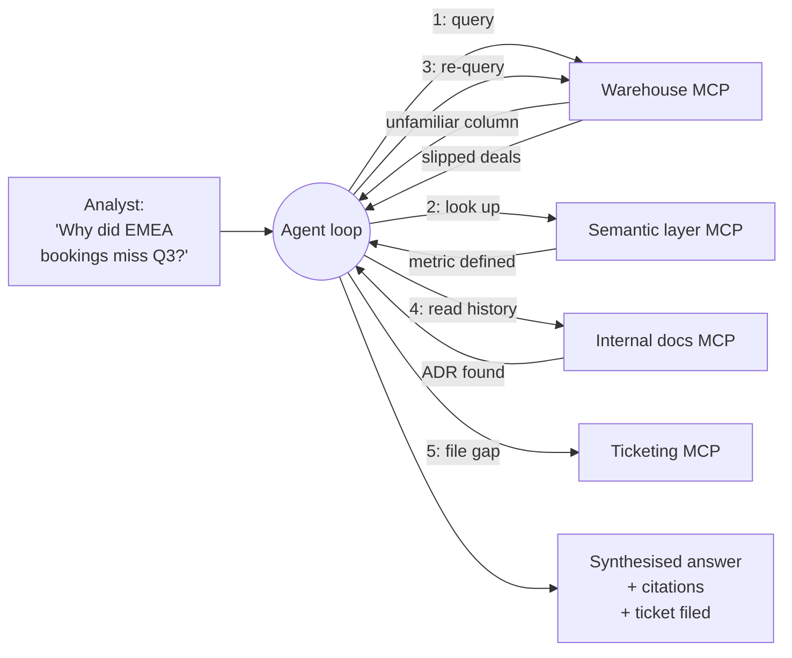

# Visual prompt — Agentic data exploration: the loop BI tools couldn't do

> Hero diagram for chapter 1. Output target: `fast-track/assets/01-agentic-exploration-loop.svg`

## Concept

A diagram of the iterative loop an analyst goes through when they're *exploring* — forming a hypothesis, querying for evidence, hitting an unfamiliar column, looking up its definition, refining the hypothesis, querying again, finding a real data gap, filing a ticket, then synthesising. The reader should leave with one mental gesture: *"oh — this is the work BI tools assumed was already done before you sat down with them, and agents over MCP servers can finally do it."*

This is the diagram that makes the chapter's central "what does MCP open up?" claim concrete. It is the visual answer to *why* agentic data work is the highest-leverage near-term use case.

The two existing chapter-1 diagrams cover the cost case (integration-tax) and the external case (protocol-network-effect). This third diagram covers the **capability case** — what the protocol opens up that *wasn't possible before*, not just *cheaper than before*.

## Audience cue

Senior engineering leader. Reading inline at chapter width. Should land in under 20 seconds. The reader's "aha" should be the **iterative shape** — not a single query, not a fixed pipeline, but a refinement loop that branches based on what the previous step returned.

## Required elements

**Left edge — the analyst and the question**

A small analyst glyph (neutral, no face) on the far left, with a speech bubble containing a real exploratory question:

> *"Why did EMEA bookings miss in Q3?"*

Beneath the analyst, a small caption:

> *"Open-ended. The question that BI dashboards can't answer because the answer requires roaming."*

**Centre — the agent loop, drawn as iterative**

The agent in the centre of the canvas, drawn so that **iteration is visible**. Three options for how to render iteration; pick whichever the illustrator finds most legible:

- A spiral or curved arrow that visibly returns to itself, with **numbered iteration markers (1, 2, 3, 4, 5)** along the path.
- A series of stacked "passes" through the same agent box, each pass labelled with what it did.
- A central agent node with a curved feedback arrow looping back into itself, annotated with "refines and re-queries."

The numbered iteration shape is probably the strongest because it makes the *progression* legible — the reader can follow steps 1→5 and see how the agent's understanding develops.

**Around the agent — four MCP servers**

Arranged around the agent (radial or stacked beside it):

- **Warehouse MCP server** — *"Snowflake / BigQuery / etc."*
- **Semantic layer MCP server** — *"Metric definitions, joins, lineage."*
- **Internal docs MCP server** — *"ADRs, runbooks, decision history."*
- **Ticketing MCP server** — *"Filing a ticket when the agent finds a real gap."*

Each server should carry the same MCP-server visual treatment used in chapters 2 and 3 (server-stack glyph, distinct rounded rectangle, separate process affordance).

**The iteration story along the loop**

Each numbered iteration carries a small annotation showing what *kind* of step it was. Five iterations is the right number — enough to feel like exploration, few enough to read at a glance:

1. **Query** — agent calls Warehouse: *"EMEA bookings, Q3, by close month"*
2. **Look up context** — agent calls Semantic Layer: *"What does `booking_amount_normalised` mean?"*
3. **Refine and re-query** — agent calls Warehouse again: *"Same query, but using the corrected metric"*
4. **Read history** — agent calls Internal Docs: *"ADR explaining why Q3 close-date logic changed"*
5. **File a gap** — agent calls Ticketing: *"Pipeline-stage dimension missing for this analysis"*

Render these as small numbered annotation cards along the loop path, each with a one-line label. The reader should be able to scan 1→5 and see the *shape* of exploration without having to read each card carefully.

**Right edge — the synthesised output**

A panel showing what comes out the other end:

- A short synthesised answer: *"EMEA bookings missed by 12%. Root cause: 4 large deals slipped from Sept→Oct due to a procurement-cycle change. The metric definition was correct after Iteration 2."*
- A list of citations the agent included.
- A small annotation noting *"Side effect: ticket filed for missing pipeline-stage dimension."*

This is the chapter's unspoken claim made tangible: *the agent didn't just answer; it left the system slightly better than it found it.*

**Caption banner along the bottom**

> *"Exploration is iterative. BI tools assumed the question was already known. Agents over MCP servers don't have to."*

This is the punchline.

## Style direction

- Consistent with the rest of the track. Same palette, typography, node treatment as chapters 1–3.
- The **iteration shape** is the focal feature. The numbered markers along the loop should be the most prominent typographic element after the analyst's question.
- MCP servers around the agent visually quieter than the agent itself — they're tools the agent uses, not the protagonists.
- Iteration annotation cards subtle but legible. A monospace or technical font for the example queries (so they read as "data-system actions") with regular sans-serif for the descriptions.
- Use a sober palette. The diagram is about *capability*, not excitement; avoid heavy accent colour or "AI energy" treatments.
- Generous whitespace. The diagram has many elements; whitespace is what makes it scannable.

## Aspect ratio / format

- 16:9 landscape (e.g. 1920×1080), SVG preferred, transparent background.
- Should read well at 800px chapter width. At thumbnail size, the **iteration shape** must remain visible even if individual annotation cards become illegible — the reader should see "loop with multiple stops" before any details.

## Anti-requirements

- **Don't draw this as a linear pipeline.** A linear flow (analyst → agent → answer) defeats the entire teaching point. The shape must be visibly iterative — that's the property BI tools lack.
- No "AI sparkles," no glow effects, no neural-network imagery. The agent is a labelled box, the same as in chapters 2 and 3.
- No 3D, no isometric.
- No literal vendor logos (no Snowflake, no Jira, no Confluence). Generic labels only.
- Don't make the loop visually similar to chapter 5's eval-feedback-loop. That diagram is about *engineering discipline* (eval gates → ship/iterate); this diagram is about *runtime exploration* (data → context → refinement → output). They're different ideas and shouldn't blur into each other. Quick test: chapter 5's loop returns to "tool surface change" as the trigger; this loop returns to "agent" as the central reasoning point. Composition should reflect that difference.
- Don't make the analyst's question look like a chat-prompt UI. It's the analyst's actual question, not a screenshot of an interface.
- No "before BI / after MCP" comparison panel. The chapter already has the integration-tax before-after diagram for that mode of contrast; this one stands on its own as the post-MCP exploration shape.

## Reference Mermaid (structural ground truth)

The Mermaid captures the iteration sequence but flattens it into a left-to-right flow that doesn't *look* iterative — the numbered hops blur into a complex mesh. The hero illustration's job is to render the iteration as a visibly cyclic shape so the reader sees the loop *before* they read the labels.
