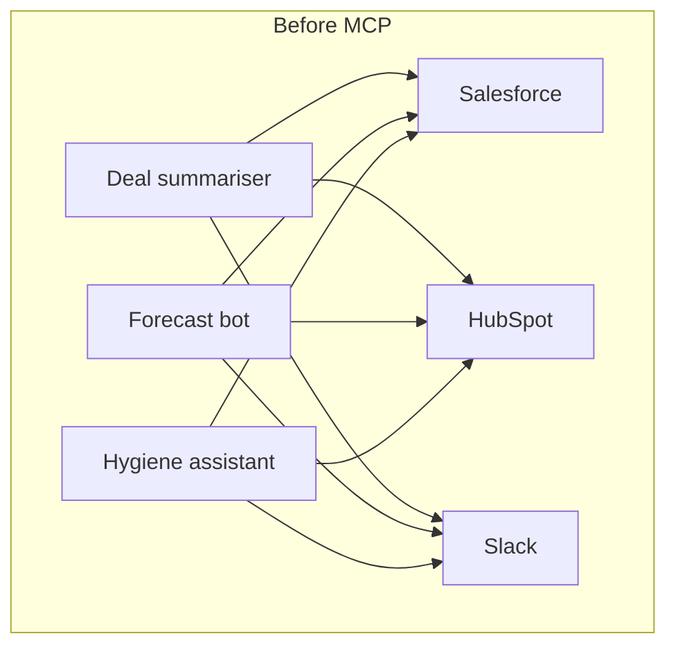
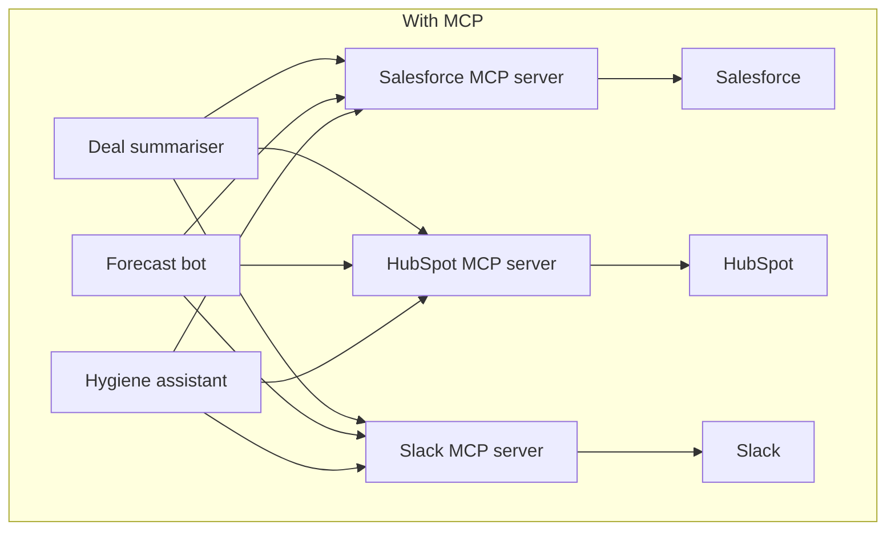

# Visual prompt — Integration tax: before and after MCP

> Hero diagram for chapter 1. Output target: `fast-track/assets/01-integration-tax-before-after.svg`

## Concept

A side-by-side comparison illustrating the collapse of an N×M integration mesh into an N+M hub-and-spoke topology once MCP is adopted. The reader should grasp in under 10 seconds that the *number of integration paths* shrinks dramatically, and that the *integration servers themselves* become the new shared asset. This is the visual that earns the phrase "integration tax."

## Audience cue

Senior engineering leader (CTO, VP Eng, Head of). Reading at thumbnail size in a chapter scroll. Should not need to study it — the contrast between the two halves should be the punchline.

## Required elements

**Left panel — labelled "Before MCP" (or "Without a protocol"):**

- Three AI agent nodes on the left, stacked vertically:
  - "Deal summariser"
  - "Forecast bot"
  - "Pipeline-hygiene assistant"
- Three external system nodes on the right, stacked vertically:
  - "Salesforce"
  - "HubSpot"
  - "Slack"
- A line from **every** agent to **every** external system — i.e. 9 lines forming a dense mesh.
- Each line should subtly suggest "bespoke client": dashed, or annotated with small repeated icons (e.g. a tiny gear or wrench glyph), or in a slightly fatigued colour. The visual texture should feel "noisy" — that's the point.
- A small caption beneath: "9 bespoke integration paths. Auth, retries, rate limits — duplicated in each."

**Right panel — labelled "With MCP":**

- Same three AI agent nodes on the left.
- A vertical band of three **MCP server** nodes in the middle:
  - "Salesforce MCP server"
  - "HubSpot MCP server"
  - "Slack MCP server"
- The same three external system nodes on the right.
- Lines from each agent into a single shared bus / hub region containing the MCP servers (3 lines on the left side of the bus).
- One clean line from each MCP server to its corresponding external system (3 lines on the right side).
- Total visible lines: ~6, dramatically less dense than the left panel.
- Lines should look "first-class" — solid, confident, in the diagram's primary accent colour.
- Small caption beneath: "6 paths. Integration logic owned once, by the team that should own it."

**Across the top, spanning both panels:**

- A title or banner: "N × M  →  N + M".
- Use mathematical notation visibly. This is the punchline.

## Style direction

- Clean, modern technical-illustration register. Think *Stripe Press* or high-end developer-tool marketing diagrams (Vercel, Linear, Anthropic's own brand).
- Muted, professional palette: two or three colours plus a neutral background. A warm accent (amber / coral) for the "before" mesh to subtly suggest friction; a cool accent (teal / blue) for the "after" hub to suggest calm.
- Generous whitespace. The reader's eye should land on the contrast, not on decoration.
- Sans-serif typography (Inter, IBM Plex Sans, or similar). Labels legible at thumbnail size.
- Subtle drop shadows or rounded-rectangle nodes are fine. Avoid heavy borders.

## Aspect ratio / format

- 16:9 landscape (e.g. 1920×1080), SVG preferred, transparent background.
- Should also read well rendered at 800px wide (chapter inline width).

## Anti-requirements

- No 3D, no isometric perspective, no skeuomorphic devices.
- No decorative human figures, no stock-clipart agents-with-faces.
- No literal "money on fire" or other heavy-handed pain metaphors. The density of the mesh on the left is the metaphor — let it do the work.
- No corporate logos (do not draw Salesforce / HubSpot / Slack actual brand marks — use neutral labelled rectangles).
- No clutter: avoid extra annotations, footnotes, or legend boxes unless strictly necessary.

## Reference Mermaid (structural ground truth)

The Mermaid is structurally accurate but visually flat. The hero illustration's job is to make the *density contrast* between the two halves visceral — that's what the Mermaid can't do.
