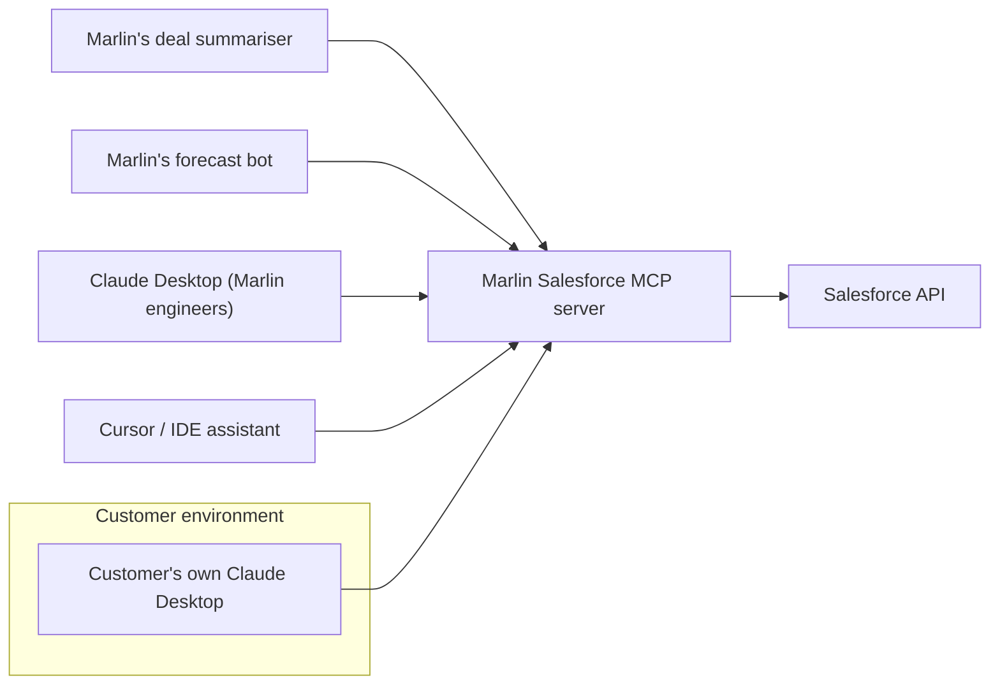

# Visual prompt — Protocol network effect: one server, many hosts

> Hero diagram for chapter 1. Output target: `fast-track/assets/01-protocol-network-effect.svg`

## Concept

A single MCP server in the centre, consumed by many different *hosts* arranged around it — Marlin's internal agents, Claude Desktop, Cursor, an internal helpdesk bot, and a customer's own AI environment. The reader should grasp that once an integration is written *as an MCP server*, it stops being internal plumbing and becomes a portable surface that anyone with a compliant host can consume. This is the visual that sells the strategic prize: **the integration surface becomes a product surface**.

If diagram 1 (the integration-tax collapse) explains *why MCP saves you cost*, this diagram explains *why MCP creates new value*. The two should feel like a pair.

## Audience cue

Senior engineering leader. The diagram needs to make the "why does this go on the strategy slide?" point land in one glance. The shape of the diagram — central asset, many independent consumers — should itself communicate "leverage" or "platform" without needing the words.

## Required elements

**Centre of the canvas:**

- A prominent, polished node labelled **"Marlin Salesforce MCP server"** (or similar). Visually weighted as the "hub" — slightly larger, with a clear primary-colour fill and a subtle elevation (drop shadow / glow). It's the protagonist of the picture.
- Below or beside the central node, a small annotation: *"Owned by Marlin's integration team. One implementation."*

**Arranged in a radial / orbital pattern around the centre, five host nodes:**

1. **"Marlin's deal summariser"** — internal agent, branded subtly to suggest "ours."
2. **"Marlin's forecast bot"** — internal agent.
3. **"Claude Desktop (engineering team's laptops)"** — labelled to make clear this is a generic third-party host.
4. **"Cursor / IDE assistant"** — another generic third-party host.
5. **"Customer's own Claude Desktop"** — visually distinguished slightly from the others (different colour outline, or grouped within a faint dashed boundary labelled *"Customer environment"*) to emphasise this one crosses the org boundary.

Each host connects to the central server with a clean line. Arrows or markers should convey *consumption* (host → server), not bidirectional sync.

**Visual grouping:**

- The four "Marlin internal + developer tooling" hosts can sit in one quadrant arc.
- The single "Customer's own Claude Desktop" sits in its own quadrant, set apart, with the dashed customer-environment boundary around it. This separation is load-bearing — it's how the diagram says "this also crosses out to your customers."

**A label or banner:**

- Small heading at the top of the canvas: *"One MCP server. Many hosts. One integration becomes a platform surface."*
- Optional small caption near the customer-environment node: *"Your integration is now something customers consume directly."*

## Style direction

- Same visual language as diagram 1 (consistency across the chapter is important). Same palette, same typography, same node treatment.
- The central server node is the focal point — it should have the most visual weight (size, contrast, optional subtle glow).
- Lines from hosts to server should be calm and confident — solid strokes, the same accent colour used for the "After MCP" half of diagram 1. This visually links the two diagrams.
- Generous whitespace around the radial layout.
- The customer-environment dashed boundary should be subtle but unmistakable — a 1px dashed line in a softer neutral.

## Aspect ratio / format

- 16:9 landscape (e.g. 1920×1080), SVG preferred, transparent background.
- Should read well at 800px chapter width.

## Anti-requirements

- No 3D, no isometric, no perspective tricks.
- No literal logos for Claude Desktop / Cursor / etc. — use neutral labelled rectangles. The diagram is about the *pattern*, not the products.
- No human figures, no laptops-with-screens drawn as hardware. Stay abstract.
- Avoid making the radial layout look like a "sun with rays" or "atom" — it should feel like a network topology, not a celestial diagram. Lines from host to server should be straight or gently curved, not radiating uniformly outward.
- No arrows in both directions — consumption is the point, and bidirectional arrows imply sync semantics that aren't accurate.

## Reference Mermaid (structural ground truth)

The Mermaid captures the topology but flattens the hierarchy — every node looks equally weighted, and the customer-environment boundary reads as a footnote rather than the strategic point. The hero illustration's job is to make the central server *look like* the asset and to make the customer-environment node *feel like* it lives somewhere else.
