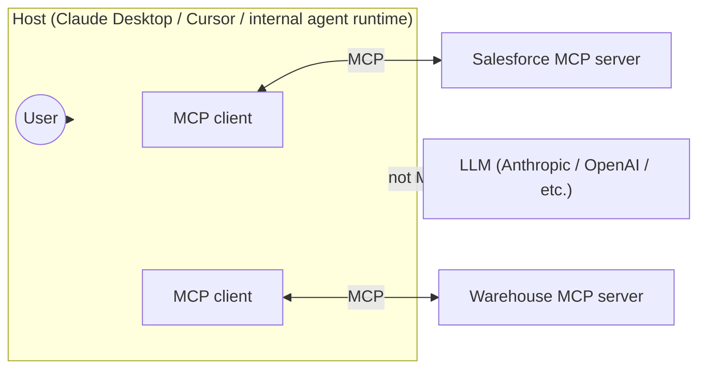

# Visual prompt — Host, client, server, LLM: the anatomy of an MCP system

> Hero diagram for chapter 2. Output target: `fast-track/assets/02-host-client-server-anatomy.svg`

## Concept

An anatomy diagram showing the four parts of a working MCP system — **host**, **client**, **server**, **LLM** — and where each one sits. The reader should leave understanding three things at a glance:

1. The **host** is where the agent loop lives, and it owns the LLM connection.
2. The **client** is a small component *inside* the host that speaks MCP — there can be many of them, one per server connection.
3. The **server** is a separate process owned by your platform team; the **LLM** is a separate service that the host calls and is *not part of MCP*.

This is the canonical "what is MCP architecturally" picture. Diagram 1 in chapter 1 made the cost case; this one makes the structure case. Together they form the reader's working model.

## Audience cue

Senior engineering leader. Reading inline at chapter width. Should be parseable in under 15 seconds. The labels "host," "client," "server," and "LLM" should all be unmistakably positioned and visually distinct.

## Required elements

**A clearly-bounded host region** — a large rounded-rectangle container labelled **"Host"** with a sub-label *"Claude Desktop · Cursor · internal agent runtime"*. This is the main visual chamber of the diagram. The host should *contain* the client(s) visually — the client is not a peer of the host, it lives inside it.

**Inside the host region**, two **MCP client** components — small rounded rectangles labelled **"MCP client"**. Two is enough to show plurality without clutter. They should look like sub-components of the host, not co-equal entities.

**Outside the host, to the right**, two **MCP server** components — labelled distinctly, e.g. **"Salesforce MCP server"** and **"Warehouse MCP server"**. Each is its own process. Show this with a small "process" affordance — a subtle dashed boundary, a server-stack glyph, or a slight visual weight indicating "this runs separately."

**Connections between clients and servers**: each client connects to one server. The connection lines should be clearly labelled as **"MCP"** (small label on the line, or a small badge on the wire). This is the visual answer to "where is the protocol?" — it's the wire, not the boxes.

**Outside the host, to the bottom or side**, an **LLM service** — labelled **"LLM (Anthropic / OpenAI / etc.)"**. The host connects to it with a separate, visually distinct line — *not* labelled MCP. A small annotation should make explicit: **"The LLM is not part of MCP. The host calls it directly."** This is a critical teaching point and should not be subtle.

**Far left**, a small **User** glyph or label, with a single line into the host, marked **"prompts / actions"**.

**Optional small annotations** as callouts, sparingly:

- On the host: *"Owns the orchestration loop and the user session."*
- On a server: *"Separate process. Owned by your platform team."*
- On the LLM line: *"Independent of the protocol. Swap models without changing servers."*

These callouts are the chapter's load-bearing teaching points; they are worth the space if they don't crowd the diagram.

## Style direction

- Same visual language as the chapter 1 hero diagrams (consistency across the track is important). Same palette, same typography, same node treatment.
- The **host** region is the visual centre of gravity — largest, slightly tinted background, clear boundary.
- **Servers** sit outside the host, distinct in colour from the host's interior to emphasise the process boundary.
- **LLM** node is visually distinct from both host and servers — perhaps a different shape (a slightly different rounded rectangle, or a subtly different fill) to reinforce "this is a different category of thing."
- Connection lines are clean, confident, in the primary accent colour. The MCP-labelled lines should look identical to each other (because they speak the same protocol). The LLM connection line should look subtly different (because it isn't MCP).
- Generous whitespace. No legend box — labels go on the elements themselves.

## Aspect ratio / format

- 16:9 landscape (e.g. 1920×1080), SVG preferred, transparent background.
- Should read well at 800px chapter width.

## Anti-requirements

- No 3D, no isometric perspective, no perspective tricks.
- No literal logos for Claude / Cursor / OpenAI / Salesforce — neutral labelled rectangles only.
- No icons-with-faces, no anthropomorphised agents, no decorative humans.
- Avoid the temptation to draw the LLM *inside* the host. It is *called by* the host, not contained by it. The visual must respect this.
- Avoid making the clients look like peers of the host or of the servers — they are sub-components of the host. Visual hierarchy must convey this.
- No clutter: no protocol-stack diagrams, no JSON message bubbles, no sequence-diagram-style annotations. Those concepts are covered by the inline Mermaid sequence diagram in the chapter; this hero illustration is structural.

## Reference Mermaid (structural ground truth)

The Mermaid is structurally correct but flat — the host doesn't visually dominate, the LLM doesn't visually separate from the servers, and the "not MCP" label on the LLM connection lands as an afterthought rather than a load-bearing teaching point. The hero illustration's job is to make the host's containment, the server process boundary, and the LLM's independence from MCP all immediately legible.
