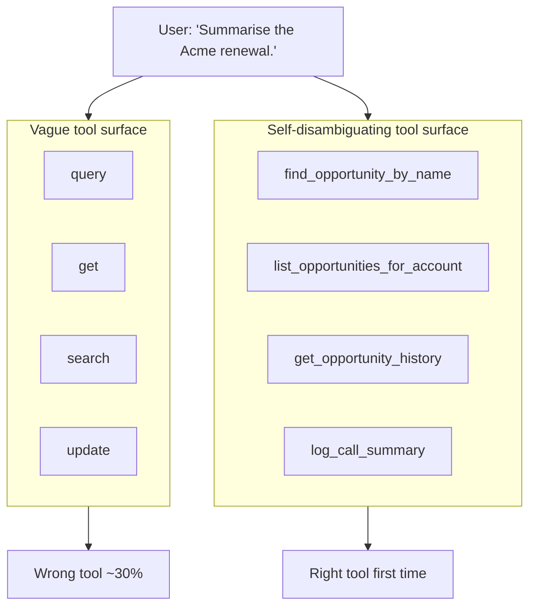

# Visual prompt — Tool descriptions are prompts (not documentation)

> Hero diagram for chapter 2. Output target: `fast-track/assets/02-tool-descriptions-as-prompts.svg`

## Concept

A side-by-side illustration showing what the LLM "sees" when deciding which tool to call. On one side, a vague tool surface (`query`, `get`, `search`, `update`) results in the model guessing. On the other side, a self-disambiguating tool surface (`find_opportunity_by_name`, `list_opportunities_for_account`, `get_opportunity_history`, `log_call_summary`) results in the model picking confidently and correctly.

The reader should grasp that **tool naming and descriptions are read by the model, not by humans** — they are the surface that decides agent behaviour, not documentation about it. This is the chapter's load-bearing claim.

## Audience cue

Senior engineering leader. Reading inline. Should land in under 15 seconds. The contrast — vague vs self-disambiguating — should be immediate. The reader should walk away thinking *"oh, the description is a prompt"*.

## Required elements

**A user prompt at the top, spanning both halves:**

A speech-bubble or prompt-style block containing the same user request feeding both sides:

> *"Summarise the Acme renewal."*

This is the input to both scenarios — the same request, two different tool surfaces, two different outcomes.

**Left panel — labelled "Vague tool surface":**

- A list of tool entries, each rendered as a small card or row, showing tool name and description:

  - `query` — *"Queries the Salesforce database."*
  - `get` — *"Gets a record."*
  - `search` — *"Searches Salesforce."*
  - `update` — *"Updates a record."*

- An arrow from the user prompt into this tool list.
- A "model thought" indicator coming out of the tool list — a small thought-bubble or annotation reading something like: *"…which one? Maybe `search`? Or `query`?"* — conveying ambiguity.
- A red/amber outcome indicator at the bottom: *"Wrong tool ~30% of the time. Tokens spent on guessing."*

**Right panel — labelled "Self-disambiguating tool surface":**

- A list of tool entries, same visual treatment:

  - `find_opportunity_by_name` — *"Use this when the user asks about a specific deal or opportunity by name."*
  - `list_opportunities_for_account` — *"Use this when the user wants all open deals for an account."*
  - `get_opportunity_history` — *"Use this after find_opportunity_by_name when the user asks how a deal has changed over time."*
  - `log_call_summary` — *"Use this when the user asks you to record a call summary against a deal."*

- An arrow from the user prompt into this tool list.
- A "model thought" indicator showing a confident pick: *"`find_opportunity_by_name` — clear match."*
- A green/positive outcome indicator at the bottom: *"Right tool first time. Description does the work."*

**Across the top, a banner caption:**

> *"The model reads these. They are prompts, not documentation."*

This is the punchline. It should be visually prominent without dominating.

## Style direction

- Consistent with the rest of the track's visual language — same palette, typography, node treatment.
- The two panels should mirror each other in structure so the differences in *content* are what the eye lands on.
- Tool-name text should be in a monospace or code-style font to make it visually clear these are *strings the model sees*, not prose. Descriptions in regular sans-serif.
- The "model thought" indicators should look distinctly like *the model's perspective* — a soft, slightly translucent thought bubble in a neutral colour. Not a chat bubble (chat bubbles imply conversation; this is internal reasoning).
- Use colour sparingly to mark the contrast: the vague side warm/amber accents on the outcome indicator only; the self-disambiguating side cool/teal accents on the outcome indicator only. Don't tint the whole panels — keep the tool surfaces themselves visually neutral so the *content* contrast carries the meaning.
- Generous whitespace. The diagram is dense by necessity; it must not feel cramped.

## Aspect ratio / format

- 16:9 landscape (e.g. 1920×1080), SVG preferred, transparent background.
- Should read well at 800px chapter width. At thumbnail size, the contrast between the two tool lists should still be visible even if individual descriptions become illegible.

## Anti-requirements

- No literal "model brain" imagery, no anthropomorphised LLM. The "model thought" indicators are abstract bubbles, not characters.
- No 3D, no isometric, no perspective.
- No screenshots of real chat interfaces. The diagram is conceptual.
- Don't draw the LLM as a separate node connected by arrows — the diagram is *about what the model sees*, so the model's perspective is the implicit viewpoint, not a node in the picture.
- Don't include a full code block of the JSON tool definition. The chapter's text and code snippet handle that; the hero diagram should be readable without code literacy.
- Avoid green-checkmark / red-X icons on the outcome indicators if possible — they read as "test passing/failing" rather than "model behaviour better/worse." Prefer typographic or colour-bar treatment.

## Reference Mermaid (structural ground truth)

Mermaid struggles to express the side-by-side "what the model sees" framing — it's not a topology, it's a comparison. The closest structural sketch is something like:

The Mermaid captures the bones — same prompt, two surfaces, two outcomes — but cannot convey the descriptions, the model's "thinking," or the contrast in feel between guessing and confident selection. The hero illustration's job is to carry all three.
