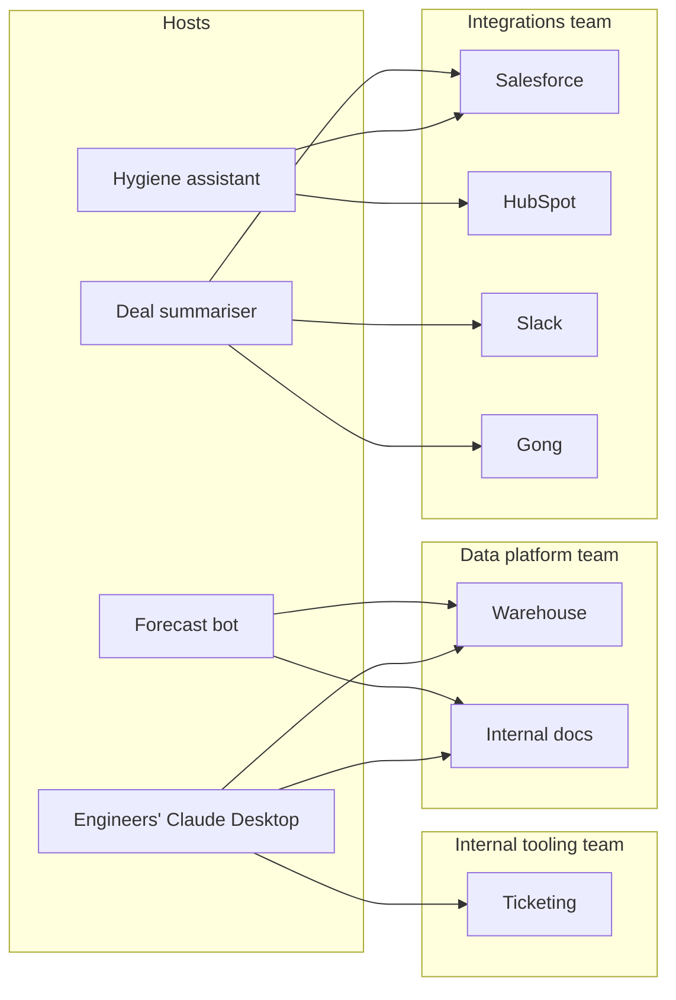

# Visual prompt — Many small servers, owned by the right teams

> Hero diagram for chapter 3. Output target: `fast-track/assets/03-many-small-servers-topology.svg`

## Concept

A realistic production topology for an organisation a year into MCP investment — multiple hosts, multiple servers, with **ownership attributed visibly** by team. Two smaller insets show the gateway pattern and the federation pattern as alternatives, framed clearly as optimisations applied later rather than defaults.

The reader should leave with two takeaways:

1. The default architecture is **many small purpose-built servers, owned by the right teams**. This is what good production-shape MCP looks like.
2. Gateways and federation are real patterns but **not the default** — they're sized as smaller insets to convey "you'll get to these eventually, with cause."

## Audience cue

Senior engineering leader. Reading inline. The diagram has more elements than chapter 1's heroes, but the visual hierarchy should still resolve at thumbnail size: the eye lands first on the main "many small servers" picture, then on the two smaller insets to the side.

## Required elements

**Main panel — "Default: many small purpose-built servers"**

A two-column layout showing **hosts** on the left and **servers** on the right, with connections between them.

Hosts (left column, four of them):

- "Deal summariser"
- "Forecast bot"
- "Pipeline-hygiene assistant"
- "Engineers' Claude Desktop"

Each host is a rounded rectangle. The first three should look like internal applications (one visual treatment); the fourth should look subtly different to convey "developer tool, not a built feature" — perhaps a slightly different fill or a small annotation.

Servers (right column, seven of them):

- "Salesforce"
- "HubSpot"
- "Slack"
- "Gong"
- "Warehouse"
- "Internal docs"
- "Ticketing"

Each is a rounded rectangle with the "MCP server" affordance (a small server-stack glyph or distinct shape so the reader can tell at a glance that these are separate processes).

Connections: clean lines from hosts to the servers each one consumes. Not every host connects to every server — the realistic shape is selective. Approximate connections to draw:

- Deal summariser → Salesforce, Gong, Slack
- Forecast bot → Warehouse, Internal docs
- Hygiene assistant → Salesforce, HubSpot
- Engineers' Claude Desktop → Warehouse, Internal docs, Ticketing

**Ownership attribution — the load-bearing visual feature:**

The servers should be **grouped by owning team** with subtle background tints or labelled cluster boundaries:

- **Integrations team owns**: Salesforce, HubSpot, Slack, Gong
- **Data platform team owns**: Warehouse, Internal docs
- **Internal tooling team owns**: Ticketing

The ownership groupings are the chapter's argument made visible — *integration logic ends up in the team that should own it*. Each cluster should be labelled with the owning team name. Use a soft cluster background tint, not a hard border.

A small caption at the top of the panel: *"Many small servers. Owned by the right teams. Connected directly to the hosts that need them."*

**Inset 1 (smaller, top-right) — "Gateway pattern (use sparingly)"**

A single MCP server in the centre labelled "Gateway server", with two or three downstream services behind it (labelled neutrally — "Service A", "Service B", "Service C"). One host connects to the gateway. The whole inset should be visually compressed — clearly secondary. A small caption beneath: *"Useful when downstreams are an implementation detail, or for centralised auth/audit. Cost: a new system to operate."*

**Inset 2 (smaller, bottom-right) — "Federation pattern (rare)"**

An MCP server in the centre labelled "Aggregator server", with arrows out to three other MCP servers (each with the server-stack glyph). One host connects to the aggregator. Same visual compression as inset 1. A small caption beneath: *"Useful when your product's value is aggregating other people's MCP servers. Almost certainly not the first thing your platform team should build."*

**Visual hierarchy across the whole composition:**

- Main panel ~70% of the canvas, dominant.
- Insets ~30% combined, stacked on the right side, each clearly smaller and subtly de-emphasised (lower contrast, smaller type).

The hierarchy itself is the message: the default is the big picture; the alternatives are real but secondary.

## Style direction

- Consistent with the rest of the track's visual language — same palette, typography, node treatment.
- Ownership clusters use soft background tints (~10% opacity colour fills) with team-name labels in a slightly muted weight. The clusters should feel ambient, not loud.
- Hosts on the left should be visually consistent with the host element from chapter 2's anatomy diagram (carry the language across chapters).
- Servers should carry the same visual treatment as chapter 2's anatomy diagram (carry the language).
- Insets are visually de-emphasised: lower contrast, slightly muted, smaller scale. They should read clearly as "alternatives" not "alternatives of equal weight."
- Generous whitespace between the main panel and the insets.

## Aspect ratio / format

- 16:9 landscape (e.g. 1920×1080), SVG preferred, transparent background.
- Should read well at 800px chapter width. At thumbnail size, the main panel must dominate and the ownership clusters should still be perceptible (even if individual server names become illegible).

## Anti-requirements

- No 3D, no isometric.
- No literal vendor logos.
- Don't draw the insets at the same visual weight as the main panel — that would imply "three patterns, all equivalent," which is the opposite of the chapter's argument.
- Don't connect every host to every server — that re-creates the N×M mesh from chapter 1's "before MCP" diagram, which is exactly the picture this is *not*. Selective, realistic connections only.
- Avoid arrows between servers in the main panel. Servers are independent; coupling them is what gateways and federation are for, and those live in the insets.
- No pricing tags, no "team size" annotations, no decorative org-chart elements. Ownership clusters are labelled with team names only.

## Reference Mermaid (structural ground truth)

The Mermaid captures the topology and ownership groupings but cannot convey the *visual hierarchy* (main pattern dominant; alternatives secondary) and cannot show the gateway and federation insets without flattening them to peers. The hero illustration's job is to make the default obviously dominant and the alternatives clearly subordinate.
