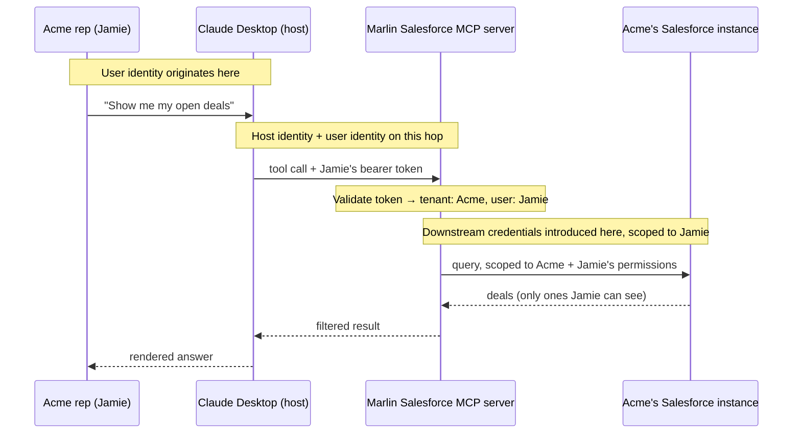

# Visual prompt — Multi-tenancy: three identities flowing through one request

> Hero diagram for chapter 3. Output target: `fast-track/assets/03-multi-tenancy-identity-flow.svg`

## Concept

A single end-to-end request traced through a hosted MCP server, with **three distinct identities** colour-coded and visually tracked across the entire flow:

1. **Host identity** — *which application* is calling (e.g. Claude Desktop).
2. **User identity** — *who* the action is for (e.g. "Acme rep, Jamie").
3. **Downstream credentials** — *what the server uses* to call its upstream (e.g. an OAuth token scoped to Jamie's Salesforce permissions).

The reader should leave with one mental gesture: *"oh — three different things flow through, and they must not be conflated."* This is the single most consequential teaching point in chapter 3, because conflating these is how multi-tenant SaaS leaks data.

## Audience cue

Senior engineering leader. Reading inline at chapter width. The diagram has more visual elements than chapters 1 and 2's heroes — that's necessary. The colour-coding is the reader's anchor: each identity gets its own colour, and a reader scanning the diagram should be able to follow any single colour from origin to use.

## Required elements

**A horizontal flow, left-to-right**, with five stations:

1. **User** — labelled "Acme rep, Jamie" (a small avatar-style icon is fine, but neutral — no face).
2. **Host** — labelled "Claude Desktop (Acme's deployment)". Visually a rounded-rectangle container.
3. **MCP server** — labelled "Marlin Salesforce MCP server". Visually a server-stack glyph or distinct rounded rectangle.
4. **Downstream API** — labelled "Acme's Salesforce instance". Same visual treatment as the server but distinct (different colour family) to convey "external system."

Lines/arrows between each station show the request flow. Each arrow should carry **identity badges** — small inline tags showing which identities are present on that hop.

**The three identity tracks, colour-coded:**

- **Host identity** (e.g. amber/warm) — appears on the arrow from host → server, labelled "host: Claude Desktop". Disappears after the server (the server doesn't propagate host identity downstream).
- **User identity** (e.g. teal/cool) — originates at the user, rides through host → server (as part of the bearer token), and is **scoped through** the server into the downstream call as the requesting principal. Visually traceable end-to-end.
- **Downstream credentials** (e.g. purple/distinct) — originate *at the server* (a small visual indicator that they live there — a key-glyph, a vault box). They appear *only* on the arrow from server → downstream API. The reader should clearly see they do not come from the user or host.

**A central server "validation" panel** — inside the MCP server box, a small annotated block showing what happens there:

- "Validate token"
- "Identify tenant: Acme"
- "Identify user: Jamie"
- "Issue scoped downstream call"

This is where the three identities are reconciled, and the diagram should make this the visual centre of gravity.

**Tenant boundary indicator:**

A faint dashed boundary or background tint around the user, host, and downstream API labelled **"Acme tenant"**. The MCP server itself sits *outside* the tenant boundary (it's Marlin's server), but the request is *scoped* into Acme's tenant by the validation step. This boundary is what the diagram is teaching: cross-tenant data leakage looks like an arrow that leaves the boundary going to the wrong place, and the reader should be able to imagine that failure mode by looking at the picture.

**A small legend** at the bottom or right edge:

- 🟠 Host identity — *which application*
- 🟢 User identity — *who the action is for*
- 🟣 Downstream credentials — *what the server uses*

Use the actual colours of the diagram, not these emoji. The legend is essential because the colour-coding is what carries the meaning.

## Style direction

- Same visual language as chapters 1 and 2's hero diagrams. Same typography, same node shapes, same general accent palette — but with two new accent colours introduced for the second and third identity tracks. The three identity colours should be perceptually distinct (run them past a colour-blindness checker).
- The validation panel inside the server is the focal point of the diagram — it's where the identities get reconciled. Give it slightly more visual weight than the surrounding stations.
- Identity badges on arrows should be small, pill-shaped tags with the identity colour as their fill. Legible but not dominant.
- The "Acme tenant" dashed boundary should be subtle but unmistakable.
- Generous whitespace despite the density. If it feels cramped, drop the user-station icon and just use a labelled circle.

## Aspect ratio / format

- 16:9 landscape (e.g. 1920×1080), SVG preferred, transparent background.
- Should read at 800px chapter width. At thumbnail size, the three colour tracks should still be distinguishable even if labels become illegible.

## Anti-requirements

- No 3D, no isometric, no perspective.
- No literal logos for Claude / Salesforce — neutral labelled rectangles.
- No anthropomorphised servers, no character avatars beyond a simple neutral user glyph.
- Don't make this a sequence diagram (the chapter has one in Mermaid). This is a *spatial* diagram — the reader sees the whole flow at once and follows colour tracks across it. Sequence-diagram lifelines would defeat the purpose.
- Don't conflate the user identity arrow and the downstream credentials arrow visually. They must look distinctly different even at a glance — that's the entire teaching point.
- Avoid putting all three identity colours on every arrow. Each arrow carries only the identities relevant on that hop. Showing them all everywhere obscures which identities are *introduced* at which station.

## Reference Mermaid (structural ground truth)

The Mermaid sequence diagram captures the temporal flow but cannot show the *three colour tracks* as parallel things visible all at once. The hero illustration's job is to make the parallelism visible — and to make the tenant boundary visible — so the reader can imagine cross-tenant leakage by looking at the picture.
