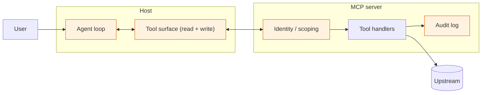

# Visual prompt — The risk surface map: where each risk lives

> Hero diagram for chapter 4. Output target: `fast-track/assets/04-risk-surface-map.svg`

## Concept

A geographic map of an MCP system showing **where each risk class lives** along the request path. The diagram takes the now-familiar architecture (user → host → server → upstream) and overlays a labelled risk badge at each interface where a risk class concentrates.

The reader should leave with one mental gesture: *"I now know which part of the system to look at when someone says 'prompt injection,' 'confused deputy,' 'tool poisoning,' or 'exfiltration.'"* This is the chapter's orientation map — not a deep-dive on any single risk, but the picture that makes the deep-dives navigable.

## Audience cue

Senior engineering leader. Reading inline at chapter width. Should land in under 20 seconds. The reader should be able to point at the diagram in a security review and say "the issue is *here*, not *there*."

## Required elements

**A horizontal architecture spine** running left to right, reusing the visual language from chapter 2's anatomy diagram and chapter 3's identity-flow diagram:

- **User** (far left)
- **Host** (rounded-rectangle container, labelled "Host: Claude Desktop / Cursor / internal agent runtime")
- **MCP server** (separate process, labelled "Hosted MCP server: e.g. Marlin Salesforce")
- **Upstream system** (labelled "Upstream: Salesforce / warehouse / etc.")

Connection arrows between the stations as in earlier chapters.

**Risk badges overlaid at the interfaces:**

Each risk class gets a clearly-styled **badge** (a small labelled pill or tag with a category icon) positioned at the interface where the risk concentrates. The badges should look like annotation overlays on the architecture, not nodes in the graph.

The risks and their positions:

1. **Prompt injection** — badge sits *inside the host*, attached to the agent loop. Sub-label: *"Untrusted data enters the model's context."*
2. **Tool poisoning** — badge sits *on the connection between host and server*, attached to "tool descriptions." Sub-label: *"Tool descriptions are prompts. Supply-chain risk."*
3. **Confused deputy** — badge sits *on the connection between server and upstream*. Sub-label: *"Server's credentials > user's permissions."*
4. **Cross-tenant leakage** — badge sits *on the server itself*. Sub-label: *"Identity scoping at the server boundary."*
5. **Exfiltration via tool surface** — badge spans *across the agent's read and write tools inside the host*. Sub-label: *"Read-tools × write-tools = exfiltration paths."*
6. **Repudiation / audit gap** — badge sits *on the server*, near the tool-call boundary. Sub-label: *"Per-tool-call audit logging."*
7. **DoS / cost runaway** — badge sits *inside the host*, attached to the agent loop. Sub-label: *"Iteration caps; per-session cost budgets."*

Each badge should also carry a small **STRIDE category tag** (S, T, R, I, D, E) for readers who think in that vocabulary. Quietly, not loud.

**A small legend** at the bottom of the diagram:

- Each risk class as a coloured-coded chip with the STRIDE letter in brackets.
- An indication that the colour-coding maps to the STRIDE category groups (Information disclosure risks one colour, Tampering risks another, etc.) — which lets a reader scan the map and see clusters of related risks.

**Optional small annotations** along the top:

- *"Trust boundaries"* indicators at the user→host, host→server, and server→upstream interfaces. Each as a thin dashed vertical line. These help the reader see *why* a particular risk concentrates at a particular interface — risks tend to live where trust boundaries are crossed.

## Style direction

- Consistent with the rest of the track. Same architecture spine visual treatment as chapters 2 and 3.
- Risk badges in a sober palette — muted oranges, ochres, and warm greys for the risk colour family. **Avoid bright reds**; the chapter is "manage these risks," not "fear these risks."
- STRIDE letter tags in a small monospace font, low contrast, subordinate to the risk-class label.
- Trust-boundary dashed lines very subtle — barely perceptible. They're an aid to comprehension, not a loud feature.
- Generous whitespace. Risk badges should breathe — a crowded map defeats the purpose.

## Aspect ratio / format

- 16:9 landscape (e.g. 1920×1080), SVG preferred, transparent background.
- Should read well at 800px chapter width. At thumbnail size, the architecture spine should still be unmistakable; individual risk-class labels can become illegible as long as the *positions* of the badges remain clear.

## Anti-requirements

- **No alarmist imagery.** No skull icons, no glowing red zones, no warning triangles. This is an orientation map, not a threat poster.
- No 3D, no isometric.
- No vendor logos.
- Don't make the badges so large they obscure the architecture spine — the spine has to remain readable as the geographic anchor.
- Don't put every risk on every interface. Each risk lives somewhere specific; placing it correctly is the value.
- Avoid arrows or lines connecting risks to each other. They're independent risk classes, not a graph.
- Don't include mitigations on the diagram itself. The chapter handles those in prose; the diagram is *where* risks live, not how to fix them.

## Reference Mermaid (structural ground truth)

The Mermaid captures the architecture but cannot convey **risk badges as overlays** — Mermaid's `classDef` colours nodes wholesale, which is the wrong abstraction. The hero illustration's job is to keep the architecture visually recognisable while overlaying labelled risk badges that the reader can scan independently.
