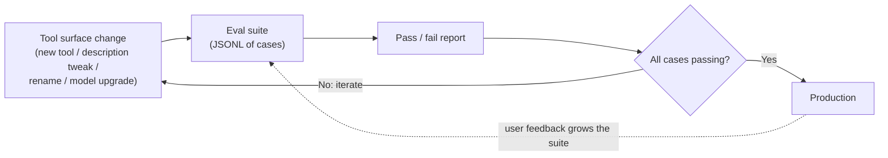

# Visual prompt — Evals as the regression-test loop

> Hero diagram for chapter 5. Output target: `fast-track/assets/05-eval-feedback-loop.svg`

## Concept

A diagram showing the feedback loop that closes the gap between "demo worked" and "production works" — a JSONL eval suite running on every change to a tool surface, gating merges, surfacing regressions before users do. The reader should leave with the gesture: *"oh — evals are unit tests for tool selection, and the discipline is in the loop, not the technology."*

This is the chapter's load-bearing claim made visible. It's the diagram a leader can point at in a planning conversation and say "we're missing this part."

## Audience cue

Senior engineering leader. Reading inline at chapter width. Should land in under 15 seconds. The shape — a closed loop with a clear "ship / iterate" decision point — should itself communicate "this is a continuous practice, not a one-time check."

## Required elements

A **closed-loop diagram** with five stations connected in sequence, returning to the start. The loop should read clockwise (left-top → right-top → right-bottom → left-bottom → back to left-top), or as a circle, depending on which composition reads cleaner.

**Station 1 — "Change to tool surface"**

A rounded rectangle labelled **"Tool surface change"** with sub-items as small bullets:

- new tool added
- tool description tweaked
- tool renamed
- model upgraded

This makes the *kinds of changes* concrete. The reader should recognise that even "innocent" changes (a description tweak, a model upgrade) belong here.

**Station 2 — "Eval suite runs"**

A rounded rectangle labelled **"Eval suite"** showing a small representation of a JSONL file — three or four visible cases stacked, each on its own line, in a code-style monospace font:

```
{"prompt": "Summarise the Acme deal", "expect": ["find_opportunity_by_name", "get_opportunity_history"]}
{"prompt": "What deals does Jamie own?", "expect": ["list_opportunities_for_owner"]}
{"prompt": "Show deals closing this month", "expect": ["list_opportunities_by_close_date"]}
```

A small label beneath: *"~30 cases. Runs in under a minute."*

**Station 3 — "Pass / fail report"**

A rounded rectangle showing a results panel — a few cases with checkmarks, one or two with crosses (use sober typographic markers, not loud icons). A summary line: *"28/30 passed."*

**Station 4 — "Decision: ship or iterate"**

A diamond-shape decision node, labelled **"All cases passing?"**. Two outgoing arrows:

- **Yes →** ships, leading to Station 5.
- **No →** loops back to Station 1, labelled clearly *"iterate on the tool surface."*

The "No" arrow is the crucial one — it's the regression-test discipline made visible.

**Station 5 — "Production"**

A rounded rectangle labelled **"Production"** with a small annotation: *"User feedback feeds back into eval cases."* An arrow from Production curving back to Station 2 (the eval suite) shows that real production prompts grow the eval suite over time. **This is the second loop**, subtler than the main one — it's how the eval suite stays relevant as user behaviour evolves.

**Caption banner**

Along the top or bottom, a single-sentence caption:

> *"Evals are regression tests for tool selection. Run on every change. Failures are red."*

## Style direction

- Same visual language as the rest of the track. Same palette, typography, node treatment.
- The loop itself is the focal feature. Stations should be roughly equal in visual weight — no single station dominates, because the value is the *loop*, not any one box.
- Decision diamond uses a slightly different shape (proper diamond / rhombus) to read as "this is where the gate is."
- The pass/fail markers use sober typography (✓ / ✗ in a slightly off-black) rather than green-checkmark / red-cross icon set — same reasoning as the chapter 2 tool-descriptions diagram.
- The "user feedback grows the eval suite" feedback arrow is rendered subtler than the main loop arrows — thinner, slightly muted — so it reads as "secondary loop" rather than competing with the main flow.
- Generous whitespace inside the loop. The empty centre matters; it makes the cyclic shape obvious.

## Aspect ratio / format

- 16:9 landscape (e.g. 1920×1080), SVG preferred, transparent background. A square or 4:3 ratio could also work given the cyclic composition; pick whichever lets the loop breathe.
- Should read well at 800px chapter width. At thumbnail size, the loop shape itself should be unmistakable even if individual station labels become illegible.

## Anti-requirements

- No 3D, no isometric.
- No CI/CD-themed iconography (build pipelines, gear chains, robot arms). The diagram is about the *concept* — eval-as-regression-test — not about a specific tooling implementation.
- Don't draw the agent or the LLM in this diagram. The loop is about the *engineering discipline around tool surface changes*, not about runtime agent behaviour.
- Don't show real-looking screenshots of CI dashboards. The eval-suite station shows JSONL content because that *is* what an eval suite is; that's appropriately literal. CI dashboards would be inappropriately literal.
- Avoid green/red dominating the visual. The chapter framing is calm-and-disciplined, not pass/fail-as-drama.
- No celebratory imagery on the "ship" path. Shipping is the normal state; the diagram is about the *gate*, not the celebration.

## Reference Mermaid (structural ground truth)



The Mermaid captures the topology but cannot convey the *cyclic nature visually* — Mermaid's left-to-right layout flattens the loop. The hero illustration's job is to render this as an actual closed loop the reader sees as a continuous practice.
