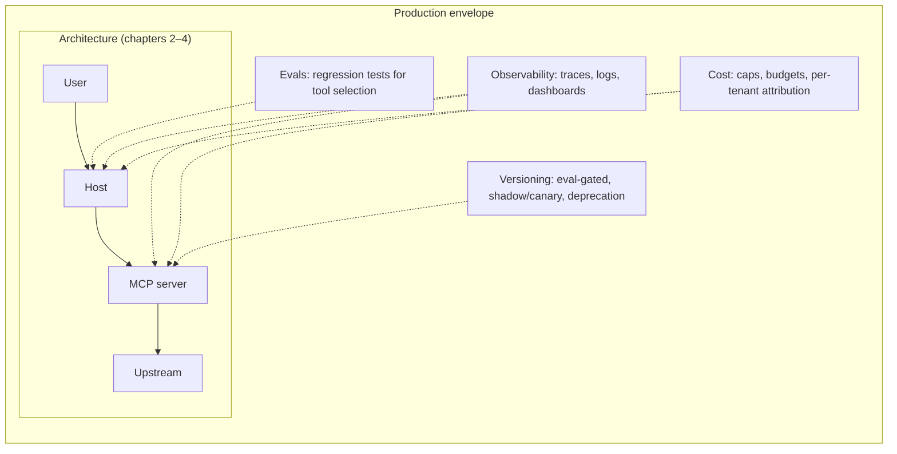

# Visual prompt — The production envelope: the four pillars wrapped around an MCP system

> Hero diagram for chapter 5. Output target: `fast-track/assets/05-production-envelope.svg`

## Concept

A consolidating diagram that takes the now-familiar MCP architecture (host → server → upstream, from chapters 2–4) and wraps it in the **four pillars of production discipline**: evals, observability, cost, versioning. The reader should see that the architecture is the *core* and the pillars are the *envelope* — production-grade isn't a different system, it's the same system surrounded by the discipline that makes it operable.

This is the chapter's closing picture and, by virtue of consolidating chapters 2–5, also the closing picture of the whole track.

## Audience cue

Senior engineering leader. Reading inline at chapter width, but also a candidate for a single-frame summary that could stand alone if extracted. Should land in under 20 seconds. The reader's gesture: *"this is what production-grade looks like — the architecture is necessary, the envelope is what makes it sufficient."*

## Required elements

**Centre of the canvas — the architecture spine**

A compressed version of the now-familiar MCP architecture, drawn as a small horizontal flow:

- **User** → **Host** (containing client + agent loop) → **MCP server** → **Upstream**

Compressed enough to be the *core* of the diagram visually, not the focus. Use the same visual language as chapters 2 and 3. Keep labels minimal — the reader has seen this picture three times by now and only needs the silhouette.

A small label beneath the spine: *"Architecture (chapters 2–4)"*.

**Surrounding the spine — four pillars as labelled bands**

Four labelled bands or quadrants surround the architecture spine. Each pillar is a band with a clear title, a one-line description, and 2–3 concrete artefacts.

**Pillar 1 — Evals (top-left or top)**

- Title: **"Evals"**
- One-liner: *"Regression tests for tool selection."*
- Artefacts:
  - JSONL of cases
  - runs on every change
  - failures gate merges

**Pillar 2 — Observability (top-right or right)**

- Title: **"Observability"**
- One-liner: *"Trace-shaped, not log-shaped."*
- Artefacts:
  - structured per-tool-call logs
  - per-session traces
  - aggregate dashboards

**Pillar 3 — Cost (bottom-right or bottom)**

- Title: **"Cost"**
- One-liner: *"Multi-dimensional surface; bound it."*
- Artefacts:
  - per-session iteration cap
  - per-session cost cap
  - per-tenant attribution

**Pillar 4 — Versioning (bottom-left or left)**

- Title: **"Versioning"**
- One-liner: *"Tool surfaces change; breakage is silent."*
- Artefacts:
  - eval-gated changes
  - shadow / canary rollout
  - deprecation discipline

**Connections from pillars to the architecture**

Each pillar should have a thin connecting line or annotation indicating *where in the architecture it touches*:

- Evals → the host/agent-loop region (evals exercise tool selection)
- Observability → spans the whole spine (every component emits telemetry)
- Cost → host (iteration caps), server (per-tenant attribution)
- Versioning → server (tool surface)

These connections should be subtle — thin lines, low contrast — so they support comprehension without crowding the picture.

**A wrapping frame**

The four pillars together form an envelope around the architecture. A faint outer frame or background tint can reinforce the "wrapping" gesture if it doesn't feel decorative.

**Caption banner** along the top:

> *"The architecture is necessary. The envelope is what makes it operable."*

This is the closing claim of the track.

## Style direction

- Consistent with the rest of the track. Same palette, typography, node treatment.
- The architecture spine is intentionally **smaller and visually quieter** than the surrounding pillars — the pillars are the focus of *this* diagram, even though they're the *envelope* of the system. This inversion is deliberate and on-message: chapter 5 is about the work that wraps the architecture.
- Pillar bands in subtly different background tints, drawn from the existing palette but each distinct enough to be read individually. Soft, low-saturation; no loud colour-blocking.
- Pillar titles in a slightly larger weight than the rest of the diagram's text — they're the labels the eye anchors on.
- Connecting lines from pillars to the architecture spine are the subtlest visual element — they should support comprehension without dominating.
- The wrapping frame, if used, very subtle — a 5-10% opacity tint or a thin outer rule.

## Aspect ratio / format

- 16:9 landscape (e.g. 1920×1080), SVG preferred, transparent background. A square or 1:1 ratio could also work given the four-quadrant composition; pick whichever lets the pillars breathe equally.
- Should read well at 800px chapter width. At thumbnail size, the four pillars and their titles must remain perceptible even if artefact bullets become illegible.

## Anti-requirements

- No 3D, no isometric.
- No "infinity loop" or "DevOps figure-eight" iconography. This is not a maturity-model poster.
- Don't put the four pillars at exactly equal weight if it makes the diagram feel like a corporate framework slide. Slight asymmetry in band sizes or pillar arrangement is welcome if it keeps the diagram feeling like an honest engineering picture rather than a marketing artefact.
- Don't include strategy or business framing in the pillars. The chapter is about *engineering discipline*; the pillars are concrete artefacts, not abstract values like "trust" or "excellence."
- No vendor logos, no specific tool names (no "Datadog," no "Prometheus," no "Anthropic"). The pillars are concept-level; specific tooling is out of scope.
- Don't visually echo chapter 4's risk-surface map too closely. They're different diagrams making different points; the eye should not confuse them.

## Reference Mermaid (structural ground truth)

Mermaid struggles to express the "envelope around a core" composition — it's an arrangement, not a topology. The closest structural sketch is something like:

The Mermaid captures the conceptual relationships (pillars touch the architecture at specific points) but cannot convey the *envelope* gesture — that the four pillars *surround* the architecture as a cohesive wrapping. The hero illustration's job is to render that surrounding so the architecture sits at the centre and the pillars enclose it.
