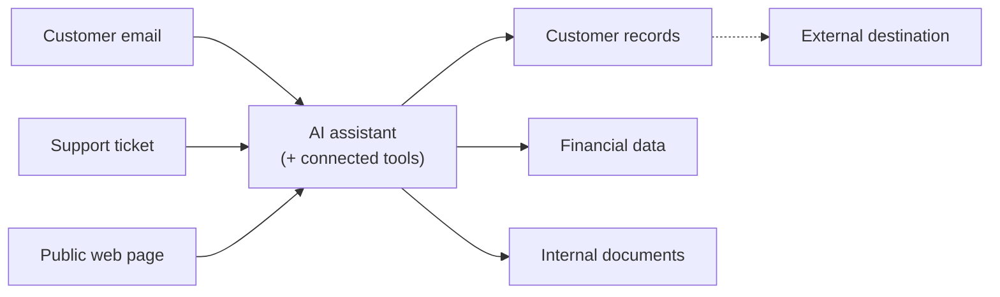

# Visual prompt — The risk surface, in business terms

> Board-room facing visual for the Executive Brief. Output target: `fast-track/assets/exec-03-risk-surface.svg`.

## Concept

A single illustration showing how an AI assistant, once connected to multiple business systems via MCP, sits at the centre of a network where **untrusted content can enter** and **sensitive data can leave**. The two arrows — *instructions in*, *data out* — are the entire concept of prompt injection and exfiltration, rendered without security jargon.

The reader (a CEO, board member, or risk-aware executive) should grasp in under 8 seconds: *the AI assistant is a new path between things that read input and things that hold data; that path needs governance.*

## Audience cue

Risk-literate but not technical. Comfortable thinking in terms of "channels," "permissions," "controls" — not "tokens," "OAuth scopes," "tool schemas." The visual should evoke the feeling of *a network with a vulnerable junction*, not a technical architecture diagram.

## Required elements

**A single landscape composition with three zones, left to right:**

### Left zone — "Where instructions can enter" (untrusted input)

Three labelled rounded rectangles stacked vertically:
- "Customer email"
- "Support ticket"
- "Public web page"

Each connected by a thin line into the central zone. Lines should feel slightly *unsettled* — perhaps a subtle wavy texture, or rendered in a warm warning accent (muted terracotta / amber) without being alarmist.

A small label above this zone: **"Untrusted input — anything the AI reads."**

### Centre zone — "AI assistant + connected tools"

A single prominent rounded rectangle labelled **"AI assistant"**, with a smaller cluster of three connector rectangles attached or inside it labelled (without logos):
- "CRM tool"
- "Warehouse tool"
- "Send-message tool"

This central node should visually feel like a *junction* — the point where many paths meet. It is rendered in a neutral colour (slate or graphite), neither warm nor cool, to read as "neither attacker nor target — the place where decisions happen."

### Right zone — "Where data can leave" (sensitive sinks)

Three labelled rounded rectangles stacked vertically:
- "Customer records"
- "Financial data"
- "Internal documents"

Each connected by a clean line from the central zone. Lines rendered in a cool accent (slate blue / teal) — the legitimate data paths.

A small label above this zone: **"Sensitive data — what the AI can reach."**

### Across the composition — the two key arrows

- **A bold curved arrow from "Customer email" (left zone) through "AI assistant" (centre) to "Customer records" (right zone).** Annotated with a small label mid-arc: *"Hidden instruction → real action."* This is the prompt-injection-into-exfiltration path. It should be visually distinct (heavier stroke, different colour from the other lines — perhaps a deeper red/coral, used **only** for this arrow).
- **A second, smaller curved arrow** from the right zone *back out* into a generic external cloud labelled "External destination" or "Outside the company," rendered with a dashed line. Annotated: *"Where data ends up."*

### Title and caption

- Title above the composition: **"The risk surface, in one picture."**
- Caption below: *"MCP doesn't create these paths. It standardises them — which makes governing them tractable, but only if you actually do."*

## Style direction

- Editorial-architectural. Think *MIT Technology Review* explainer, *Anthropic* brand, *Stripe Press*. Restrained, confident, not alarmist.
- Muted palette. The "danger" arrow should stand out by **contrast**, not saturation — a single deeper accent against an otherwise calm composition. Avoid red-alert imagery, exclamation marks, biohazard symbols.
- Generous whitespace around the centre node so it reads as a junction, not a hub-and-spoke.
- Sans-serif typography (Inter, IBM Plex Sans, GT America). Labels small but legible at thumbnail size.
- Subtle elevation on the rounded rectangles is fine. No heavy outlines.

## Aspect ratio / format

- 16:9 landscape (1920×1080), SVG preferred. Renders cleanly at 1100px wide for inline use.
- Transparent or very pale neutral background.

## Anti-requirements

- **No padlock icons, no shield icons, no skull-and-crossbones, no biohazard, no broken-chain motifs.** The brief is deliberately calm; security clip-art undermines that.
- No literal hooded-figure "hacker" silhouettes. Ever.
- No glowing red borders, no flashing-warning aesthetic.
- No 3D, no isometric, no skeuomorphic.
- No corporate logos. The CRM / warehouse / customer email examples are generic.
- No technical jargon in any label: avoid "OAuth", "RBAC", "scope", "token", "endpoint". This is the executive version.
- No human figures or faces.

## Reference structure (mermaid, for ground truth only)

The mermaid is structurally accurate but flat. The illustration's job is to make the **danger arrow** (email → AI → customer records → external) visually dominant without making the whole composition feel hostile.

## Notes

The single most important visual choice: the danger arrow should look like a *highlighted path through an otherwise neutral network*, not a fight between red and blue armies. The reader should think "ah, *that's* the channel I need to govern" — not "everything is on fire."
